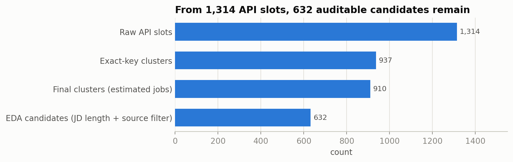

> Current status (7 October 2026): CP2 work is done (freeze D-087, held-out evaluation CP2.4, figures, final summary, CP2 presentation and mentoring on 4 Oct with feedback recorded as D-093, Phase A closed with KEEP BASELINE; CP2.3 carry-overs resolved by D-091 and D-092). CP2 is **not yet closed** only because the CP2.7 LMS upload proof is not recorded. [CP2 closeout audit](docs/checkpoint_2/CP2_Closeout_Audit_20261007.md).

# JobFit: Evidence-Grounded Job Matching and Skill-Gap Analysis

JobFit helps early-career job seekers in AI and data find jobs that fit their real profile. From a CV, it gives a ranked list of jobs best supported by the CV evidence, shows which requirements are met, partly met, or missing, and points to the exact CV text behind each result. The goal is honest matching: no match claim without evidence.

Final project for the Data Science and Machine Learning bootcamp at Dibimbing (Batch 42).


## Project status

| Checkpoint | Focus | Dates | Status |
| --- | --- | --- | --- |
| CP1 | Data collection, cleaning, feature transformation, EDA | until 27 Sep 2026 | Done |
| CP2 | Guideline and gold set, search baselines, evidence matching, recommendation list, evaluation | 28 Sep to 7 Oct 2026 | Technical work done: freeze D-087 (Hybrid Qwen, seniority rule, K 10, DeepSeek Flash extraction, GPT-6 Sol matching with Luna fallback, evidence prompt v1.1, H2v2, experience block), held-out evaluation done (CP2.4). CP2.7 presentation and mentoring done (D-093); carry-overs resolved (D-091, D-092). Not yet closed: CP2.7 LMS proof not recorded ([audit](docs/checkpoint_2/CP2_Closeout_Audit_20261007.md)) |
| CP3 | API, database, app, testing, deployment | 5 to 11 Oct 2026 | API, UI, CV coach, Docker and CI done locally; hosting deploy and deployed checks pending |

This README is updated at the end of every checkpoint.

## Problem

Job boards show many postings, but early-career candidates cannot easily tell which ones are realistic for them. Many postings labeled "AI" are not AI roles, many titles without a level still ask for 3+ years of experience, and "match scores" in existing tools rarely explain why. JobFit focuses on three questions:

1. Which jobs fit my target role and experience level?
2. For each requirement in a job, is there evidence in my CV?
3. Which skill gaps matter most for the jobs I want?

## CP1 results (done)

CP1 built and explored the job corpus. All numbers come from `data/processed/CP1_research_summary.json`, which the notebook produces.

**Corpus funnel**

| Step | Count |
| --- | ---: |
| API result slots collected (JSearch / Google for Jobs) | 1,314 |
| Estimated unique jobs after dedup | 910 |
| EDA candidates (full job description, no generic form) | 632 |
| Target-role jobs (AI, ML, data science, GenAI) | 428 |
| Indonesian target jobs | 175 |
| Early-career pool (entry level or up to 2 years) | 49 |



**Main findings**

- 128 of 405 titles with no level marker still ask for 3+ years of experience. The title alone is not a safe filter.
- 49 of 463 titles that mention AI are not target roles. Role labels need the job description, not only the title.
- Skill needs differ by role: statistics appears in 78% of data science jobs but only 2% of GenAI jobs.
- RAG appears in 53% of jobs that mention LLMs and only 4% of jobs that do not.
- 79.6% of the 372 Indonesian EDA candidates are in Jabodetabek (Greater Jakarta), and work mode is unclear in 76.3% of them.

These findings shaped the design: filter by target role first, check experience from the job text, and match skills per requirement with evidence.

All CP1 role, level, and skill labels are rule-based v0. Their accuracy will be measured against the CP2 gold set.

Full reports: [CP1.1 to CP1.6](docs/checkpoint_1/README.md).

## CP2 results (held-out test, 7 October 2026)

The configuration was frozen before any test processing (D-087). Headline on three synthetic held-out CVs (CV3-CV5) and held-out jobs:

| Metric | Stage-1 retrieval order | Final product order | Coverage |
| --- | ---: | ---: | --- |
| P@5 (macro) | 0.533 | 0.733 | 3/3 CVs |
| NDCG@10 (macro) | 0.805 | 0.960 | **CV3 and CV4 only**; CV5 unavailable because one job (F00070) is unjudged, never counted as 0 |

- Relevance labels are AI-assisted (ChatGPT), reviewed by one human, and blind to the ranking (D-088). They are not independent human gold. Because the labeling assistant and the matcher are both OpenAI-family models, correlated model preferences may inflate apparent agreement; the direction and size of this bias were not measured.
- Familiar development CVs (CV1-CV2) on held-out jobs are a separate diagnostic and are never pooled with the headline.
- Three CVs and one run per CV: the result is indicative, not a general accuracy claim. Details: [CP2.4](docs/checkpoint_2/CP2_04_Evaluation_Metrics.md), [figures](docs/checkpoint_2/CP2_05_Evaluation_Visualization.md), [summary](docs/checkpoint_2/CP2_06_Recommendation_and_Summary.md).
- After the test, a development-only prompt optimization (Phase A) found no eligible challenger, so evidence prompt v1.1 stays (D-090). It does not change the held-out result.
- Privacy: CV masking, consent and session controls are implemented and component/unit tested. End-to-end privacy validation and the original-vs-masked matching comparison have **not** been performed; they are deferred to CP3.4 and CP3.5 (D-092). Real-CV processing stays disabled.
- CP2 mentor feedback (D-093) goes to CP3: a clear waiting state for long LLM analyses, and vacancy-specific CV improvement guidance grounded in real CV evidence once the core flow is stable.

## Roadmap

The CP2 and CP3 plan follows the design update after the CP1 mentor feedback. Every decision is in the [decision log](docs/decisions.md), and every stage has a report in [docs/](docs/README.md).

### CP2: Matching and evaluation (technical work done; closure pending)

- Write an annotation guideline, run a timed labeling pilot, and build development and held-out test sets.
- Compare search baselines for the first stage: keyword, full-text search, dense embeddings, and hybrid search (RRF).
- Build the vertical slice: one CV and one pasted job description in, per-requirement results with CV evidence out.
- Extend it to a ranked recommendation list: search first, then evidence matching on the top K candidates.
- Evaluate with NDCG@10 and P@5 for the list, Evidence Macro-F1 for matching accuracy, and safety checks (quote validity, zero unsupported claims), with cost and latency.

### CP3: Product and deployment

- Backend API with FastAPI and PostgreSQL with pgvector.
- Streamlit app for the full flow: upload a CV, check the parsing summary, set optional filters, see recommendations, open the evidence, compare a pasted JD.
- End-to-end tests and CI/CD.
- Deployment with a demo path that uses synthetic CVs, and the final presentation.

### Planned upgrade: CV coach

After matching is complete, a CV coach asks the user about real projects behind each gap and turns the answers into CV bullet points, without inventing anything. A minimal version is planned for v1 if time allows; the full coach comes later. See [docs/cv-coach-plan.md](docs/cv-coach-plan.md).

## Repository structure

```text
project-job-fit/
├── config/               Skill alias list (v0) and the OpenRouter model registry
├── data/
│   ├── raw/              JSearch API responses (kept locally, not in the public repo)
│   ├── interim/          Dedup output and the frozen snapshot CP1_20260926
│   ├── processed/        Clean corpus, features, and the CP1 summary
│   ├── research/         Collection batch plans
│   └── synthetic_cvs/    Synthetic CVs for evaluation and the demo
├── docs/
│   ├── checkpoint_1/ … checkpoint_3/   One report per bootcamp checkpoint
│   ├── decisions.md      Decision log (source, reason, status of every decision)
│   ├── experiments.md    Experiment matrix and runs
│   ├── failures.md       Failure log and regression cases
│   ├── master-plan.md    CP2 and CP3 plan, dates, and budget
│   └── …                 Data contract, repo structure, privacy threat model
├── evals/                Annotation guideline, fixtures, pilot, gold labels, splits, results
├── evidence/             CP1 collection evidence, provider benchmark, related work
├── migrations/           Database migrations
├── notebooks/            CP1 research notebook; CP2 held-out evaluation and Phase A notebooks
├── prompts/              Versioned LLM prompts
├── reports/              Figures (CP1 to CP3) and the API usage ledger
├── scripts/              CP1 collection scripts and CP2/CP3 batch, experiment, and evaluation scripts
├── src/jobfit/           The Python package
│   ├── jobs/             CP1 job-corpus rules (cleaning, dedup, skills, transforms)
│   ├── schemas/ scoring/ matching/ llm/ …   Application modules (CP2 and CP3)
│   └── viz/              Chart style
├── tests/                Unit, API, and end-to-end tests
├── ui/                   Streamlit app (calls the API only)
├── .env.example          Environment variable names (copy to .env; never commit .env)
├── docker-compose.yml    Local PostgreSQL with pgvector (API and UI added in CP3)
├── Dockerfile.api, Dockerfile.ui
├── pyproject.toml        Package metadata and pytest settings
├── requirements*.txt     App, dev, and CP1 research dependencies
└── LICENSE               MIT (code only)
```

Most CP2 and CP3 files are still placeholders with a one-line note of their purpose and planned stage; [docs/repo-structure.md](docs/repo-structure.md) lists what each one is for and when it is filled.

## Getting started

Requirements: Python 3.11.

```bash
git clone <repo-url>
cd project-job-fit

python3.11 -m venv env-job-fit
source env-job-fit/bin/activate        # Windows: env-job-fit\Scripts\activate
python -m pip install -r requirements.txt -r requirements-dev.txt -r requirements-research.txt
python -m pip install -e .             # installs the jobfit package from src/
```

Run the tests (no API key needed):

```bash
python -m pytest -q
```

For CP2 work that calls models or the database:

```bash
cp .env.example .env                   # then fill OPENROUTER_API_KEY and the budget values yourself
docker compose up -d db                # local PostgreSQL with pgvector
```

Run the app (saved demo, no API key and no cost):

```bash
docker compose up -d --build           # database, API (port 8000) and UI (port 8501)
open http://127.0.0.1:8501
python scripts/e2e_check.py            # end-to-end checks against the running API
```

Without Docker: `uvicorn jobfit.api.wiring:create_default_app --factory --app-dir src` and, in a second terminal, `streamlit run ui/streamlit_app.py`. Live analysis (paid model calls) runs only outside Docker by default. Step-by-step for the freeze, the held-out test and deployment: [runbook](docs/checkpoint_3/Runbook_Freeze_Test_Deploy_20261006.md).

Reproduce CP1 (runs offline, no API key needed). The notebook needs the raw JSearch snapshot, which is not included in this public repository (see [Data](#data)). All notebook outputs, processed files, and figures are already committed, so the results can be read without running anything.

```bash
python -m jupyter nbconvert --to notebook --execute --inplace notebooks/01_research.ipynb
python scripts/refresh_cp1_docs.py
```

The notebook reads the frozen snapshot in `data/interim/snapshots/CP1_20260926/` and checks its hashes before running, so the outputs stay the same across runs. More details are in [notebooks/README.md](notebooks/README.md).

The collection scripts in `scripts/` are kept for provenance. They are not needed to rebuild the EDA and they need a JSearch API key, which is never stored in this repository.

## Data

- Source: JSearch API (OpenWeb Ninja), which returns Google for Jobs results. Snapshot `CP1_20260926`.
- Scope: AI and data roles, mainly Indonesia, with a foreign comparison group.
- The corpus is a query-based sample. Percentages describe this corpus, not the whole job market.
- Included: processed corpus and features (`data/processed/`), dedup outputs, snapshot manifest and hashes, and small API response samples in `evidence/`.
- Not included: raw API responses (`data/raw/`) and `jsearch_records.jsonl`. They contain full responses and recruiter contact details from some job descriptions. The processed files have contact details removed.
- Field definitions are in the [data contract](docs/data-contract.md).
- Job posting content belongs to the original publishers. The data is used for this study only.

## Tech stack

- CP1: Python, pandas, NumPy, matplotlib, Jupyter, pytest
- CP2: Pydantic, OpenRouter (LLM and embedding gateway), PostgreSQL with pgvector in Docker
- Planned for CP3: FastAPI, Streamlit, GitHub Actions, Railway

## Author

Gidion Depari, Dibimbing Data Science and Machine Learning Batch 42

## License

The code is released under the [MIT License](LICENSE). The license does not cover the job posting content in `data/` and `evidence/` (it belongs to the original publishers) or the third-party screenshots in `evidence/`. The CVs in `data/synthetic_cvs/` are fictional.


## Historical: development review (2 October 2026)

All A/B/C review was submitted on2October2026. [Review result and follow-ups](docs/checkpoint_2/supporting/Development_Labeling_Review_20261002.md); [current workbook index](evals/labeling/README.md). Runtime guideline v1.3 is adopted and tested offline. Reviewed-record gold is exported with explicit holds. CP2.2 implementation acceptance is DONE under D-050 following the scoped repaired live chain; broad extraction follows CP2.3 configuration evaluation. Formal tuning has not run. See the [current CP2.2 report](docs/checkpoint_2/CP2_02_Modeling_Pipeline.md).
