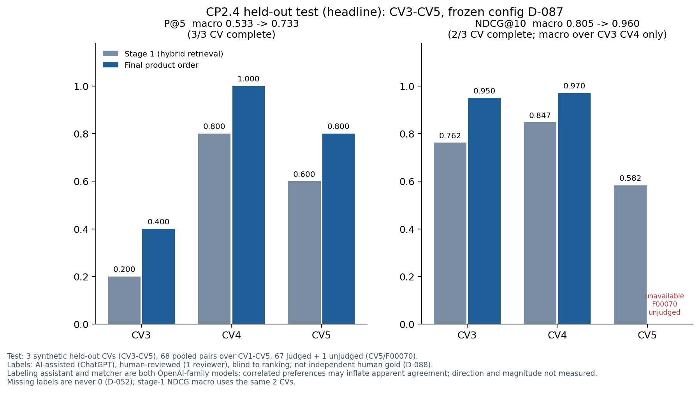

# JobFit: Evidence-Grounded Job Matching and Skill-Gap Analysis

JobFit ranks AI and data job postings for an early-career candidate's CV and shows, for every requirement, whether the CV has evidence for it, quoting the exact CV text. No match claim without evidence.

Final project for the Data Science and Machine Learning bootcamp at Dibimbing (Batch 42).


> **Current status (7 October 2026):** CP1 and CP2 are closed. CP2 closed on 7 October ([D-094](docs/decisions.md), [closeout audit](docs/checkpoint_2/CP2_Closeout_Audit_20261007.md)). CP3 is in progress: the API, the Streamlit app and Docker run locally; hosting, deployed end-to-end checks and end-to-end privacy validation are not done yet.

## Project status

| Checkpoint | Focus | Dates | Status |
| --- | --- | --- | --- |
| CP1 | Data collection, cleaning, feature transformation, EDA | until 27 Sep 2026 | **Closed** |
| CP2 | Labels, retrieval and LLM comparison, tuning, held-out evaluation | 28 Sep to 7 Oct 2026 | **Closed** (D-094). System frozen before testing (D-087); held-out evaluation done; presentation and mentoring done (D-093); post-test prompt study kept the baseline (D-090). [CP2 reports](docs/checkpoint_2/README.md) |
| CP3 | API, database, app, testing, deployment, final presentation | 5 to 11 Oct 2026 | **In progress**. See the [CP3 table](#cp3-progress) |

## The problem

Job boards show many postings, but early-career candidates cannot easily tell which ones are realistic for them. In the CP1 corpus, many postings labeled "AI" are not AI roles, many titles without a level still ask for 3+ years of experience, and existing "match scores" rarely explain why. JobFit answers three questions:

1. Which jobs fit my target role and experience level?
2. For each requirement in a job, is there evidence in my CV?
3. Which gaps matter most for the jobs I want?

## How it works

JobFit uses pretrained models; it does not train a neural network. The matching pipeline was chosen by measurement on development data and frozen before the held-out test ([D-087](docs/decisions.md); diagram in [CP2.6](docs/checkpoint_2/CP2_06_Recommendation_and_Summary.md#final-v1-architecture-d-087-freeze)):

1. **CV in:** a synthetic demo CV, or an upload that is masked locally and shown for consent before anything leaves the app.
2. **Candidate search:** hybrid PostgreSQL full-text search plus Qwen3 dense embeddings, fused with RRF; a seniority rule moves jobs asking for 3+ years down; the top 10 are analyzed.
3. **Requirements:** each job description is turned into requirement units by an LLM (DeepSeek Flash), checked against the source text and cached per job.
4. **Evidence matching:** an LLM (GPT-6 Sol, with GPT-6 Luna as fallback) labels each requirement MATCH, PARTIAL or NO_MATCH and must quote the CV word for word; quotes are verified.
5. **Score and order:** match % = (MATCH + 0.5 × PARTIAL) / required units. Jobs with unclear analysis are held in a "not fully analyzed" group instead of getting a misleading score; explicit experience conflicts get their own group.

The match percentage measures evidence coverage of the job's required units. It is not a hiring probability.

**Added in CP3 (product layers, not part of the frozen evaluation):** a FastAPI service, a Streamlit app that calls only the API, session-scoped privacy controls, a saved-results demo, Docker images and a GitHub Actions workflow.

## Key results

### CP1: job corpus (closed)

| Step | Count |
| --- | ---: |
| API result slots collected (JSearch / Google for Jobs) | 1,314 |
| Estimated unique jobs after dedup | 910 |
| EDA candidates (full job description) | 632 |
| Target-role jobs (AI, ML, data science, GenAI) | 428 |
| Early-career pool (entry level or up to 2 years) | 49 |

- 128 of 405 titles with no level marker still ask for 3+ years of experience, so a title is not a safe filter.
- 49 of 463 titles that mention AI are not target roles.
- RAG appears in 53% of jobs that mention LLMs and only 4% of jobs that do not.

Numbers come from `data/processed/CP1_research_summary.json`. CP1 role, level and skill labels are rule-based v0; they were used as filters and baselines in CP2 and were not separately scored against gold labels. [CP1 reports](docs/checkpoint_1/README.md).

### CP2: held-out evaluation (closed)

The configuration was frozen before any test processing (D-087). The headline uses three synthetic held-out CV profiles (CV3-CV5) on held-out jobs, comparing the stage-1 search order with the final product order:

| Metric | Stage-1 order | Final order | Coverage |
| --- | ---: | ---: | --- |
| P@5 (macro) | 0.533 | 0.733 | 3/3 CVs |
| NDCG@10 (macro) | 0.805 | 0.960 | **CV3 and CV4 only**: CV5's final NDCG is unavailable because one job (F00070) is unjudged, and unjudged jobs are never counted as 0 |



How to read this:

- **Labels:** relevance labels were AI-assisted (ChatGPT), reviewed by one person, and blind to JobFit's ranking (D-088). They are not independent multi-annotator gold. Because the labeling assistant and the matcher are both OpenAI-family models, correlated model preferences may inflate apparent agreement; the direction and size of this bias were not measured.
- **Scope:** three synthetic CVs, one job snapshot, one run per CV. The result is indicative, not a general claim. P@5 and NDCG@10 are ranking metrics, not accuracy.
- **Separate diagnostic:** the two development CVs (CV1-CV2) on held-out jobs are reported separately and never pooled with the headline.
- **Where the gain comes from:** most of the P@5 gain comes from the deterministic seniority rule; most of the NDCG@10 gain comes from the LLM match order ([CP2.5, figure 11](docs/checkpoint_2/CP2_05_Evaluation_Visualization.md)).
- **After the test:** a development-only prompt study (CP2.8, Phase A) found no eligible challenger, so evidence prompt v1.1 stays (D-090). It does not change the held-out result.

Details: [CP2.4 evaluation](docs/checkpoint_2/CP2_04_Evaluation_Metrics.md), [figures](docs/checkpoint_2/CP2_05_Evaluation_Visualization.md), [final recommendation and error analysis](docs/checkpoint_2/CP2_06_Recommendation_and_Summary.md).

## Current capabilities

Built and tested locally on synthetic CVs (not deployed yet):

- Demo CVs with a parsing summary; optional filters with a separate block for jobs missing the filtered value.
- Ranked recommendations from a saved demo (no API key, no cost), with "K candidates analyzed", scored, conflict and not-fully-analyzed groups.
- Per-requirement evidence with exact CV quotes, and the job posting text.
- Market skill counts, CV suggestions and a deterministic CV coach v1 that writes bullets only from the user's answers ([CV coach plan](docs/cv-coach-plan.md)).
- Session controls: masked preview with consent, heartbeat, expiry and "stop and delete session"; feedback stored as categories only.
- Live analysis with paid model calls, when enabled and an OpenRouter key is set: a fresh recommendation run, and analysis of a pasted job description against a demo CV (pasted text stays in the session).

Kept closed on purpose: provider processing of uploaded real CVs (`/cv/parse` answers 403) until the privacy validation below is done.

## Privacy status

| Level | Status |
| --- | --- |
| Implemented | Local masking, editable preview with consent bound to the exact masked text, owner-scoped sessions with expiry and delete, upload cleanup |
| Component/unit tested | Yes: privacy-control, masking and API-level tests (the API tests use a fake run, not a deployed host) |
| End-to-end privacy validation | **Not performed yet**; planned for CP3.4 |
| Original-vs-masked matching comparison | **Not performed yet**; planned for CP3.4, reported in CP3.5 |

See [D-092](docs/decisions.md) and the [privacy threat model](docs/privacy-threat-model.md). JobFit does not yet claim end-to-end privacy validation or that masking has no effect on matching quality.

## CP3 progress

| Stage | Status | Evidence and what is pending |
| --- | --- | --- |
| CP3.1 FastAPI service | Done locally | All planned endpoints, privacy controls and API tests ([report](docs/checkpoint_3/CP3_01_FastAPI_Service.md)) |
| CP3.2 Database and CI/CD | Partial | Docker images and compose work locally; PostgreSQL + pgvector holds the corpus and embeddings. The GitHub Actions workflow exists but is currently red because of three environment-dependent tests ([FAIL-35](docs/failures.md)). No hosted deployment yet ([report](docs/checkpoint_3/CP3_02_Database_and_CICD.md)) |
| CP3.3 Streamlit UI | Done locally | Full flow with privacy UX; screenshots and recording pending ([report](docs/checkpoint_3/CP3_03_Streamlit_UI.md)) |
| CP3.4 End-to-end testing | Partial | Local scripted check passed 27 of 27 (6 Oct). Pending: deployed run, live run, privacy end-to-end validation, original-vs-masked comparison, latency/cost on the deployed app, feature freeze ([report](docs/checkpoint_3/CP3_04_End_to_End_Testing.md)) |
| CP3.5-CP3.7 Final report, rehearsal, presentation | Not started | Includes the final privacy report and the test extraction/evidence results still owed by D-045 |

CP3 also carries the CP2 mentor feedback (D-093): a clear waiting state for the long LLM analysis (about 95 s at the CP2 presentation; this improves the wait experience, it does not make the model faster), and, once the core flow is stable, vacancy-specific CV improvement guidance grounded in the real CV and job description. Better CV evidence can raise the evidence-coverage score; it does not guarantee a better real fit.

## Getting started

Requirements: Python 3.11. Docker is needed for the database and the containerized app.

```bash
git clone https://github.com/Gidion123/Job-Fit.git
cd Job-Fit

python3.11 -m venv env-job-fit
source env-job-fit/bin/activate        # Windows: env-job-fit\Scripts\activate
python -m pip install -r requirements.txt -r requirements-dev.txt -r requirements-research.txt
python -m pip install -e .             # installs the jobfit package from src/
```

**Free, offline (no API key):**

```bash
python -m pytest -q                    # offline test suite; database tests skip
docker compose up -d --build           # database, API (port 8000) and UI (port 8501), saved demo only
# then open http://127.0.0.1:8501
python scripts/e2e_check.py            # end-to-end checks against the running local API
```

In a fresh clone, 3 tests currently fail because they need git-ignored local files (the raw JSearch snapshot and the local `.env` budget values); see [FAIL-35](docs/failures.md). All CP1 and CP2 notebook outputs, results and figures are committed, so they can be read without running anything.

**May cost money (OpenRouter):**

```bash
cp .env.example .env                   # fill OPENROUTER_API_KEY and the budget values yourself; never commit .env
docker compose up -d db                # local PostgreSQL with pgvector
python scripts/load_snapshot_to_db.py  # load the 632-job snapshot
uvicorn jobfit.api.wiring:create_default_app --factory --app-dir src
streamlit run ui/streamlit_app.py      # in a second terminal
```

Outside Docker, live analysis is on by default and every live run calls paid models through the project budget guard. Set `JOBFIT_LIVE_ENABLED=0` to keep the saved demo only. The Docker images always start with live analysis off. Step-by-step for the freeze, the held-out test and deployment: [runbook](docs/checkpoint_3/Runbook_Freeze_Test_Deploy_20261006.md).

**Reproduce CP1:** the notebook needs the raw JSearch snapshot, which is not included in this public repository (see [Data and limitations](#data-and-limitations)).

```bash
python -m jupyter nbconvert --to notebook --execute --inplace notebooks/01_research.ipynb
python scripts/refresh_cp1_docs.py
```

More details: [notebooks/README.md](notebooks/README.md).

## Repository structure

```text
Job-Fit/
├── config/               Model registry, retrieval settings, skill aliases, versioned pipeline configurations (frozen v4)
├── data/
│   ├── raw/              JSearch API responses (kept locally, not in the public repo)
│   ├── interim/          Dedup output and the frozen snapshot CP1_20260926
│   ├── processed/        Clean corpus, features, and the CP1 summary
│   ├── research/         Collection batch plans
│   └── synthetic_cvs/    Five synthetic CVs (CV1-CV2 development, CV3-CV5 held-out)
├── docs/                 Master plan, decision/experiment/failure logs, one report per checkpoint stage
├── evals/                Guideline, fixtures, gold labels, splits, freeze receipts, results, saved demo
├── evidence/             CP1 collection evidence, provider benchmark, related work
├── migrations/           Alembic scaffolding (no migration versions; the snapshot loader creates the schema)
├── notebooks/            CP1 research, CP2 held-out evaluation, CP2.8 Phase A
├── prompts/              Versioned LLM prompts
├── reports/              Figures (CP1, CP2, Phase A) and the API usage ledger
├── scripts/              Collection, experiment, evaluation, freeze and end-to-end scripts
├── src/jobfit/           The Python package: search, extraction, matching, scoring, privacy, session, api, eval
├── tests/                Unit, API, UI and pipeline tests
├── ui/                   Streamlit app (calls the API only)
├── .github/workflows/    CI: lint, offline tests, Docker builds, health check
├── docker-compose.yml, Dockerfile.api, Dockerfile.ui
├── .env.example          Environment variable names only (copy to .env; never commit .env)
├── pyproject.toml, requirements*.txt
└── LICENSE               MIT (code only)
```

Folder-by-folder detail: [docs/repo-structure.md](docs/repo-structure.md).

## Data and limitations

- Source: JSearch API (OpenWeb Ninja), which returns Google for Jobs results. Snapshot `CP1_20260926`. Scope: AI and data roles, mainly Indonesia, with a foreign comparison group.
- The corpus is a query-based sample; percentages describe this corpus, not the whole job market.
- Not included: raw API responses (`data/raw/`) and `jsearch_records.jsonl`, because they contain full responses and recruiter contact details. The processed files have contact details removed. Field definitions: [data contract](docs/data-contract.md).
- All evaluation CVs are synthetic. Labels come from one reviewer with AI assistance. Real-CV processing is disabled.
- Job posting content belongs to the original publishers and is used for this study only.

## Documentation

| Read | For |
| --- | --- |
| [Master plan](docs/master-plan.md) | Stage plan, dates, dependencies, current outcome |
| [Documentation index](docs/Documentation_Index.md) and [docs overview](docs/README.md) | Where everything is |
| [Decision log](docs/decisions.md) | Every decision, who made it and why |
| [CP1 reports](docs/checkpoint_1/README.md) | Data collection and EDA |
| [CP2 reports](docs/checkpoint_2/README.md) and [CP2 closeout audit](docs/checkpoint_2/CP2_Closeout_Audit_20261007.md) | Model selection, tuning, held-out evaluation, closure evidence |
| [CP3 reports](docs/checkpoint_3/README.md) | API, app, deployment, testing |

## Tech stack

- **In use:** Python 3.11, pandas, NumPy, matplotlib, Jupyter, Pydantic, PostgreSQL 17 with pgvector, OpenRouter (LLM and embedding gateway), FastAPI, Streamlit, Docker and Docker Compose, pytest, ruff, GitHub Actions.
- **Pending:** hosting on Railway (D-023).

## Next steps

1. Repair the three environment-dependent tests so CI can pass (FAIL-35), then deploy to Railway with live analysis off.
2. Run the CP3.4 checks on the deployed app, including end-to-end privacy validation and the original-vs-masked comparison, then record the feature freeze.
3. Address the CP2 mentor feedback (waiting-state UX; vacancy-specific CV guidance) within the feature freeze.
4. Final report, rehearsal and presentation (CP3.5-CP3.7).

This README is the public progress snapshot. It is updated at every checkpoint closeout and at major implementation or deployment milestones, and it never claims more than the stage reports.

## Author

Gidion Depari, Dibimbing Data Science and Machine Learning Batch 42

## License

The code is released under the [MIT License](LICENSE). The license does not cover the job posting content in `data/` and `evidence/` (it belongs to the original publishers) or the third-party screenshots in `evidence/`. The CVs in `data/synthetic_cvs/` are fictional.
