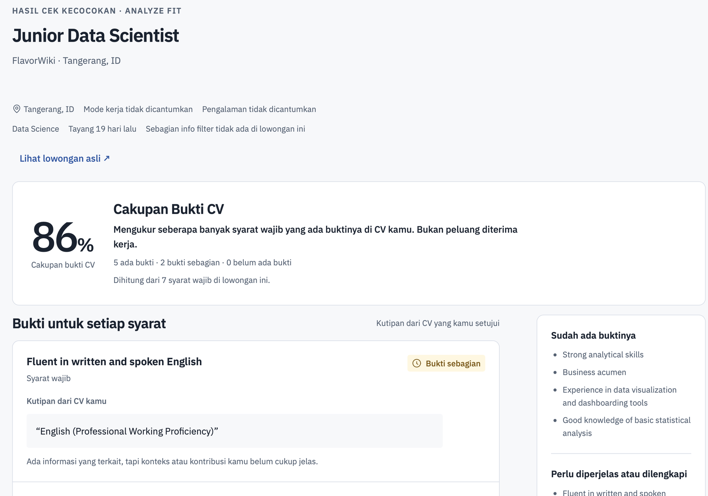
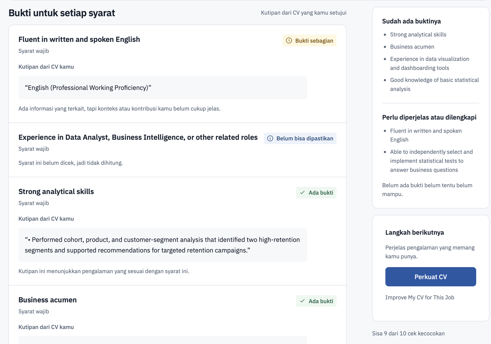
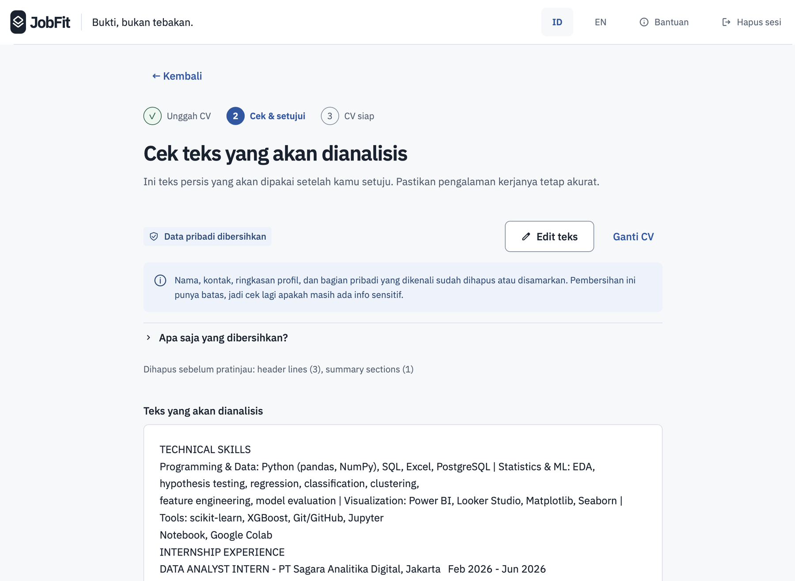
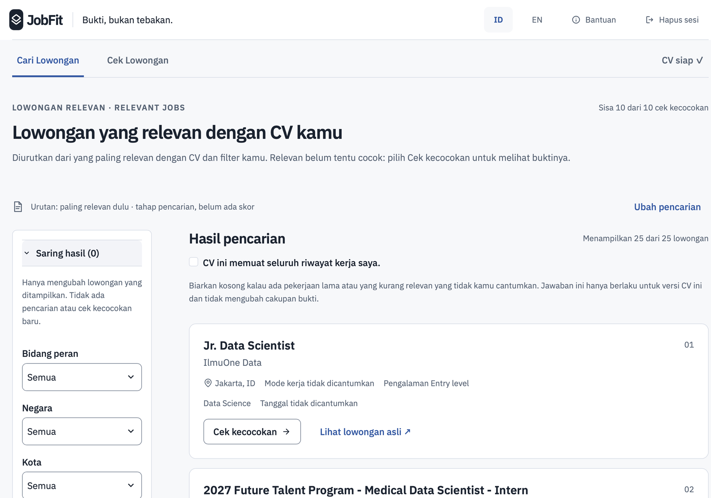
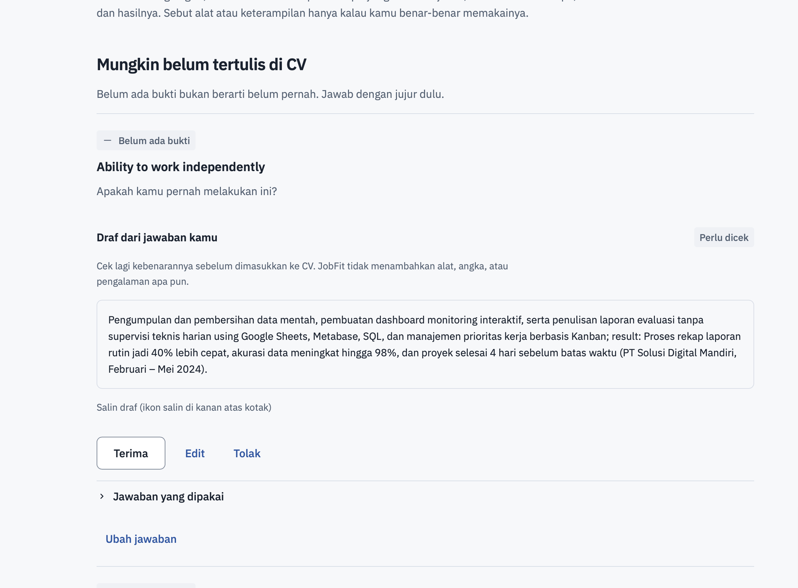
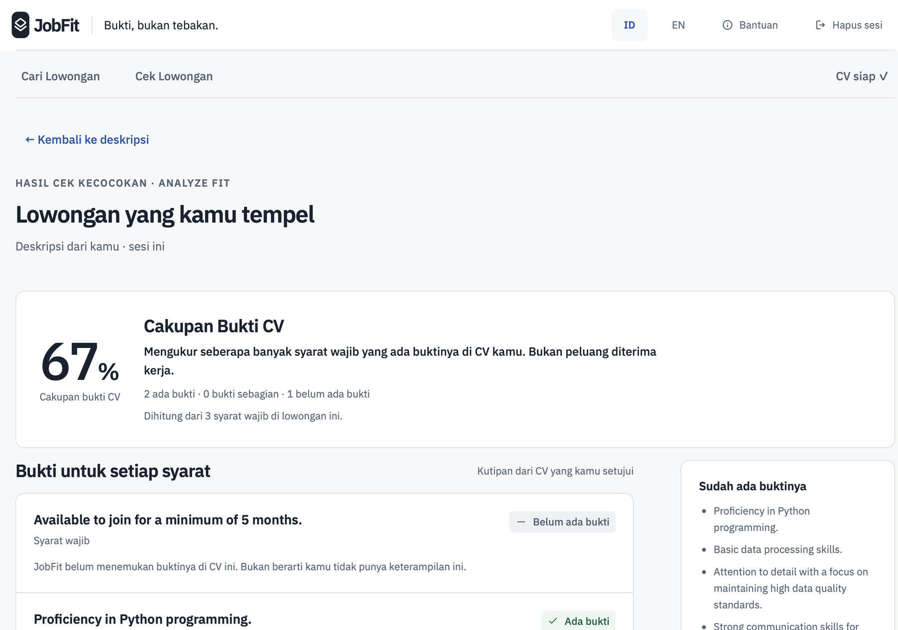
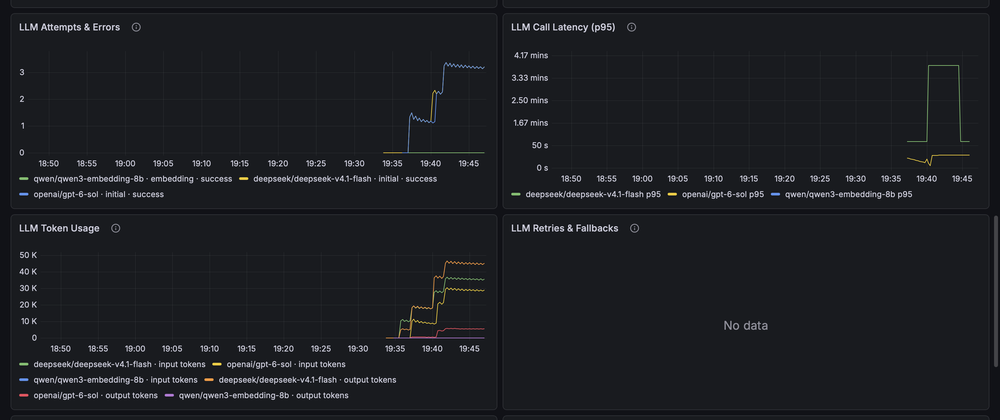
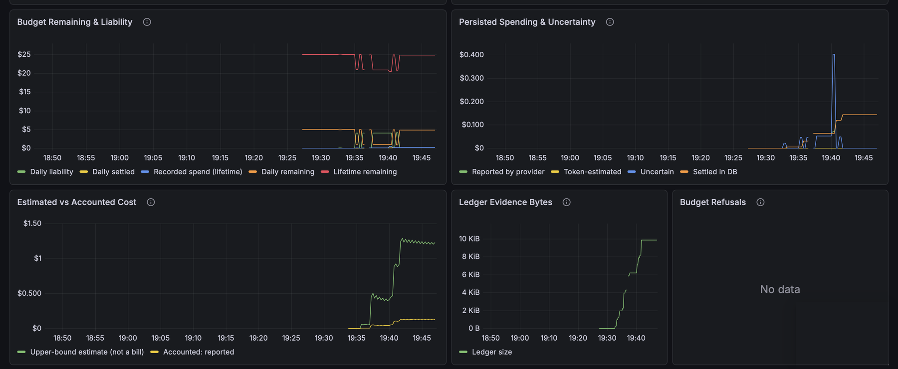

# JobFit: Evidence-Grounded Job Matching and Skill-Gap Analysis

JobFit ranks AI and data job postings for an early-career candidate's CV and shows, for every requirement, whether the CV has evidence for it, quoting the exact CV text. No match claim without evidence.

Final project for the Data Science and Machine Learning bootcamp at Dibimbing (Batch 42).

-green)


> **Current status (10 October 2026): deployed as a controlled demo.** JobFit runs on a SumoPod VPS (Ubuntu 24.04, Docker Compose) at `https://jobfit-demo.duckdns.org`, behind Caddy Basic Auth so only invited mentors can reach it. The owner ran the full real-user flow with live model calls (upload → sanitized preview → consent → parse → **Find Jobs** → **Analyze Fit** → **Improve My CV**), ran **Check a Job** on the deployed demo, and monitors the production API in a 21-panel Grafana dashboard ([screenshots](#cp3-screenshots)). Langfuse is not used for this demo; monitoring is Prometheus and Grafana (owner decision, [D-106](docs/decisions.md)). Still open: a recorded deployed privacy canary sweep and the original-vs-masked comparison (CP3.4), the D-045 blind items (CP3.5) and the release tag (CP3.6).
>
> **Earlier status (9 October 2026): ready for owner Local Mac validation.** On branch `cp3-development-20261007` (after the independently accepted privacy lifecycle at `e4c69ab`), the complete real-user flow is implemented and tested with fake providers: upload → local sanitizer → exact preview → consent → parse → **Find Jobs** (Relevant Jobs, then Analyze Fit on a chosen job) or **Check a Job** → **Improve My CV for This Job**. Uploaded CVs can be switched on **for the owner only** ([D-105](docs/decisions.md)); the public beta stays closed. Not yet done: the owner's local run with a real CV, deployment, monitoring and the public beta.
>
> **Earlier status (8 October 2026):** CP1 and CP2 are closed ([D-094](docs/decisions.md), [CP2 closeout audit](docs/checkpoint_2/CP2_Closeout_Audit_20261007.md)). CP3 is in progress: the API, the Streamlit app and Docker run locally, the dark cost-safety runtime and the persistent production ledger are done and tested (local and CI), but the app is not deployed yet and privacy has not been validated end to end. CP3 aims for a **production-grade AI engineering portfolio with a controlled public beta** on one VPS ([D-102](docs/decisions.md)); public live is **planned**, not built, and still blocked by the cost bound.

## Project status

| Checkpoint | Focus | Dates | Status |
| --- | --- | --- | --- |
| CP1 | Data collection, cleaning, feature transformation, EDA | until 27 Sep 2026 | **Closed** |
| CP2 | Labels, retrieval and LLM comparison, tuning, held-out evaluation | 28 Sep to 7 Oct 2026 | **Closed** (D-094). System frozen before testing (D-087); held-out evaluation done; presentation and mentoring done (D-093); post-test prompt study kept the baseline (D-090). [CP2 reports](docs/checkpoint_2/README.md) |
| CP3 | API, database, app, testing, deployment, final presentation | 5 to 11 Oct 2026 | **Deployed as a controlled demo** (10 Oct); final presentation on 11 Oct. See the [CP3 table](#cp3-progress) |

## The problem

Job boards show many postings, but early-career candidates cannot easily tell which ones are realistic for them. In the CP1 corpus, many postings labeled "AI" are not AI roles, many titles without a level still ask for 3+ years of experience, and existing "match scores" rarely explain why. JobFit answers three questions:

1. Which jobs fit my target role and experience level?
2. For each requirement in a job, is there evidence in my CV?
3. Which gaps matter most for the jobs I want?

## How it works

JobFit has two flows ([D-102](docs/decisions.md), live on the controlled demo since 10 Oct): **Find Jobs** (CV → search the job corpus → match) and **Check a Job** (CV + a job description you paste → match directly; the pasted text is never added to the corpus). Both end in evidence per requirement, strengths and gaps, and job-specific CV advice that never invents experience.

JobFit uses pretrained models; it does not train a neural network. The matching pipeline was chosen by measurement on development data and frozen before the held-out test ([D-087](docs/decisions.md); diagram in [CP2.6](docs/checkpoint_2/CP2_06_Recommendation_and_Summary.md#final-v1-architecture-d-087-freeze)):

1. **CV in:** a synthetic demo CV, or an uploaded CV after the local D-104 sanitizer removes identity, contact, Summary and privacy-only sections and the user consents to the exact text (see [Privacy status](#privacy-status)).
2. **Candidate search:** hybrid PostgreSQL full-text search plus Qwen3 dense embeddings, fused with RRF. In the frozen CP2 pipeline and the saved demo, a seniority rule moves jobs asking for 3+ years down and the top 10 are analyzed. **In the real-user Find Jobs flow (D-103/D-105) search does not analyze anything:** it returns up to 30 Relevant Jobs (the frozen stage-1 depth) with no score, optionally pre-filtered, and only a job the user picks with **Analyze Fit** goes through steps 3-5 (up to 10 per session, `JOBFIT_SESSION_ANALYSIS_LIMIT`).
3. **Requirements:** each job description is turned into requirement units by an LLM (DeepSeek Flash), checked against the source text and cached per job.
4. **Evidence matching:** an LLM (GPT-6 Sol, with GPT-6 Luna as fallback) labels each requirement MATCH, PARTIAL or NO_MATCH and must quote the CV word for word; quotes are verified.
5. **Score and order:** match % = (MATCH + 0.5 × PARTIAL) / required units. Jobs with unclear analysis are held in a "not fully analyzed" group instead of getting a misleading score; explicit experience conflicts get their own group.

The match percentage measures evidence coverage of the job's required units. It is not a hiring probability.

**Added in CP3 (product layers, not part of the frozen evaluation):** a FastAPI service, a Streamlit app that calls only the API, session-scoped privacy controls, a cost-safety runtime with a persistent usage ledger, a saved-results demo, Docker images, a GitHub Actions workflow, a VPS deployment behind Caddy, and Prometheus/Grafana monitoring.

## Key results

### CP1: job corpus (closed)

| Step | Count |
| --- | ---: |
| API result slots collected (JSearch / Google for Jobs) | 1,314 |
| Estimated unique jobs after dedup | 910 |
| EDA candidates (full job description) | 632 |
| Target-role jobs (AI, ML, data science, GenAI) | 428 |
| Early-career pool (entry level or up to 2 years) | 49 |

- 128 of 405 titles with no level marker still ask for 3+ years of experience, so a title is not a safe filter.
- 49 of 463 titles that mention AI are not target roles.
- RAG appears in 53% of jobs that mention LLMs and only 4% of jobs that do not.

Numbers come from `data/processed/CP1_research_summary.json`. CP1 role, level and skill labels are rule-based v0; they were used as filters and baselines in CP2 and were not separately scored against gold labels. [CP1 reports](docs/checkpoint_1/README.md).

### CP2: held-out evaluation (closed)

The configuration was frozen before any test processing (D-087). The headline uses three synthetic held-out CV profiles (CV3-CV5) on held-out jobs, comparing the stage-1 search order with the final product order:

| Metric | Stage-1 order | Final order | Coverage |
| --- | ---: | ---: | --- |
| P@5 (macro) | 0.533 | 0.733 | 3/3 CVs |
| NDCG@10 (macro) | 0.805 | 0.960 | **CV3 and CV4 only**: CV5's final NDCG is unavailable because one job (F00070) is unjudged, and unjudged jobs are never counted as 0 |


How to read this:

- **Labels:** relevance labels were AI-assisted (ChatGPT), reviewed by one person, and blind to JobFit's ranking (D-088). They are not independent multi-annotator gold. Because the labeling assistant and the matcher are both OpenAI-family models, correlated model preferences may inflate apparent agreement; the direction and size of this bias were not measured.
- **Scope:** three synthetic CVs, one job snapshot, one run per CV. The result is indicative, not a general claim. P@5 and NDCG@10 are ranking metrics, not accuracy.
- **Separate diagnostic:** the two development CVs (CV1-CV2) on held-out jobs are reported separately and never pooled with the headline.
- **Where the gain comes from:** most of the P@5 gain comes from the deterministic seniority rule; most of the NDCG@10 gain comes from the LLM match order ([CP2.5, figure 11](docs/checkpoint_2/CP2_05_Evaluation_Visualization.md)).
- **After the test:** a development-only prompt study (CP2.8, Phase A) found no eligible challenger, so evidence prompt v1.1 stays (D-090). It does not change the held-out result.

Details: [CP2.4 evaluation](docs/checkpoint_2/CP2_04_Evaluation_Metrics.md), [figures](docs/checkpoint_2/CP2_05_Evaluation_Visualization.md), [final recommendation and error analysis](docs/checkpoint_2/CP2_06_Recommendation_and_Summary.md).

## Current capabilities

Built and tested locally, then deployed as a controlled demo on 10 Oct 2026:

- Demo CVs with a parsing summary; optional filters with a separate block for jobs missing the filtered value.
- Ranked recommendations from a saved demo (no API key, no cost), with "K candidates analyzed", scored, conflict and not-fully-analyzed groups.
- Per-requirement evidence with exact CV quotes, and the job posting text.
- Market skill counts, CV suggestions and a deterministic CV coach v1 that writes bullets only from the user's answers ([CV coach plan](docs/cv-coach-plan.md)).
- Session controls: masked preview with consent, heartbeat, expiry and "stop and delete session"; feedback stored as categories only.
- Live analysis with paid model calls, when enabled and an OpenRouter key is set: a fresh recommendation run, and analysis of a pasted job description against a demo CV (pasted text stays in the session).
- **Real-user flow (D-105; automated tests with fake providers on 9 Oct, owner runs with live models on 10 Oct, [figures 1-15](reports/figures/cp3/README.md)):**
  - upload → exact sanitized preview → optional edit → consent → **Continue** (parse) → **CV ready**;
  - **Find Jobs** with optional pre-search filters (role family, country, city, experience requirement, work mode, posted within) → **Relevant Jobs** (search relevance, no score) → **Refine these results** locally (no new request) → **Analyze Fit** on a chosen job (evidence coverage, requirement-by-requirement evidence, strengths, gaps);
  - **Check a Job** with a pasted job description;
  - **Improve My CV for This Job** (existing evidence made clearer; questions for possibly missing items; confirmed gaps; "not verified");
  - honest progress states.

**Where it runs:** the controlled demo at `https://jobfit-demo.duckdns.org` (Caddy Basic Auth; credentials are shared privately with mentors), the owner-local stack (`docker-compose.owner-local.yml`, see the [owner-local runbook](docs/checkpoint_3/Runbook_Owner_Local_Validation.md)), and the free saved demo. The deployed stack keeps the public-beta controls: per-IP tickets, the session allowance, US$5/day and US$25 lifetime budgets, the persistent ledger, ZDR routing and the D-104 consent lease ([deployment guide](deploy/public-live/README.md)).

## Privacy status

| Level | Status |
| --- | --- |
| Implemented | D-104 structural data minimization (identity/contact header, Summary family and privacy-only sections removed locally; deterministic backstops), editable preview sanitized again on every edit, consent bound to the exact sanitized digest, fail-closed refusals, ZDR provider routing, owner-scoped sessions with expiry and delete, upload cleanup. Uploaded CVs reach a provider only after consent to the exact sanitized text, and only when the live gates allow it (owner-local, or the Basic Auth demo with every public-beta gate holding, D-103/D-105) |
| Measured (offline, independently accepted at `e4c69ab`) | Synthetic calibration gates and API/provider-payload/sink canary gates: no Summary or raw canary reaches a provider payload, response, log or session state |
| Component/unit tested | Yes: privacy-control, masking and API-level tests (the API tests use a fake run, not a deployed host) |
| End-to-end privacy validation | **Partly evidenced:** the owner's live runs show the sanitized preview and consent working on real flows ([figures 3-4](reports/figures/cp3/README.md)). The deployed canary sweep (no canary in logs, `/metrics` or a database dump; [deployment guide](deploy/public-live/README.md), steps 6-7) has **no recorded result yet** in CP3.4 |
| Original-vs-masked matching comparison | **Not performed yet**; planned for CP3.4, reported in CP3.5 |

Details: [D-092](docs/decisions.md) and the [privacy threat model](docs/privacy-threat-model.md). Until the CP3.4 canary sweep and the comparison are recorded, JobFit makes no claim that privacy is validated end to end or that masking leaves matching quality unchanged.

## CP3 progress

| Stage | Status | Evidence and what is pending |
| --- | --- | --- |
| CP3.1 FastAPI service | **Done (deployed)** | Public-beta API for both flows with fail-closed settings, the dark-by-default cost-safety runtime (reservations, correlated ledger, one paid operation at a time, per-IP tickets, internal token), upload hardening and the D-104/D-105 consent lifecycle. Runs on the VPS behind Caddy since 10 Oct, exporting Prometheus metrics ([report](docs/checkpoint_3/CP3_01_FastAPI_Service.md)) |
| CP3.2 Database and CI/CD | **Done** | PostgreSQL 17 + pgvector with Alembic `0001`/`0002`; GitHub Actions CI (ruff, offline tests, freeze verify, Docker builds, `/health` and ledger smoke tests). Deployed with Docker Compose on a SumoPod VPS (Ubuntu 24.04, 2 vCPU, 4 GB), API/UI/DB bound to `127.0.0.1` behind Caddy. The scheduled JSearch refresh stays planned ([report](docs/checkpoint_3/CP3_02_Database_and_CICD.md)) |
| CP3.3 Streamlit UI | **Done** | UI v3 in Indonesian (English switch): upload → sanitized preview → consent → CV ready → Find Jobs / Check a Job → Analyze Fit → Improve My CV, with honest progress and a session allowance shown in the UI. Owner runs with live models on 10 Oct ([figures 1-15](reports/figures/cp3/README.md), [report](docs/checkpoint_3/CP3_03_Streamlit_UI.md)) |
| CP3.4 End-to-end testing | **Partial** | Local scripted checks, automated privacy and public-path tests, owner live runs (local and deployed) and Grafana monitoring of the production API ([figures 16-19](reports/figures/cp3/README.md)). Not yet recorded: the deployed canary sweep, PR-10 original-vs-masked comparison and the latency/cost table ([report](docs/checkpoint_3/CP3_04_End_to_End_Testing.md)) |
| CP3.5 Final presentation and portfolio | **Partial** | Final 10-minute deck with a demo section prepared on 10 Oct (kept outside the repository). D-045 option B (blind items) not run ([report](docs/checkpoint_3/CP3_05_Final_Presentation_and_Portfolio.md)) |
| CP3.6-CP3.7 Rehearsal, release tag, presentation | Planned | Presentation on 11 Oct 2026 |

## CP3 screenshots

Captured by the owner on 10 Oct 2026. The full set with captions and capture times is in [reports/figures/cp3](reports/figures/cp3/README.md).

| Analyze Fit: evidence coverage | Evidence per requirement |
| --- | --- |
|  |  |
| **Sanitized preview before consent** | **Relevant Jobs (search order, no score)** |
|  |  |
| **Improve My CV: draft only from the user's answers** | **Check a Job on the deployed demo** |
|  |  |
| **Grafana: LLM attempts, latency and tokens** | **Grafana: budget and cost safety** |
|  |  |

CP3 also picks up the mentor feedback from the CP2 presentation (D-093):

- The LLM analysis took about 95 s, so the app needs a clear waiting state (progress or a "thinking" indicator). This makes the wait easier, not the model faster.
- Once the core flow is stable, add CV improvement suggestions for a specific vacancy, based on the real CV and job description. Adding true evidence to a CV can raise the evidence-coverage score; it does not guarantee a better real fit.

## Getting started

Requirements: Python 3.11. Docker is needed for the database and the containerized app.

```bash
git clone https://github.com/Gidion123/Job-Fit.git
cd Job-Fit

python3.11 -m venv env-job-fit
source env-job-fit/bin/activate        # Windows: env-job-fit\Scripts\activate
python -m pip install -r requirements.txt -r requirements-dev.txt -r requirements-research.txt
python -m pip install -e .             # installs the jobfit package from src/
```

**Free, offline (no API key):**

```bash
python -m pytest -q                    # offline test suite; database tests skip
docker compose up -d --build           # database, API (port 8000) and UI (port 8501), saved demo only
# then open http://127.0.0.1:8501
python scripts/e2e_check.py            # end-to-end checks against the running local API
```

Latest recorded full offline run (10 Oct 2026, [validation record](reports/validation/observability_20261010/validation.md)): 1,417 passed, 247 skipped, with 2 macOS-only baseline tests deselected. Database tests skip without the gated test database; split tests that need the git-ignored raw JSearch snapshot skip as described in [FAIL-35](docs/failures.md) (resolved). All CP1 and CP2 notebook outputs, results and figures are committed, so they can be read without running anything.

**May cost money (OpenRouter):**

```bash
cp .env.example .env                   # fill OPENROUTER_API_KEY and the budget values yourself; never commit .env
docker compose up -d db                # local PostgreSQL with pgvector
python scripts/load_snapshot_to_db.py  # load the 632-job snapshot
uvicorn jobfit.api.wiring:create_default_app --factory --app-dir src
streamlit run ui/streamlit_app.py      # in a second terminal
```

Outside Docker, live analysis is on by default and every live run calls paid models through the project budget guard. Set `JOBFIT_LIVE_ENABLED=0` to keep the saved demo only. The Docker images always start with live analysis off. Step-by-step for the freeze, the held-out test and deployment: [runbook](docs/checkpoint_3/Runbook_Freeze_Test_Deploy_20261006.md).

**Reproduce CP1:** the notebook needs the raw JSearch snapshot, which is not included in this public repository (see [Data and limitations](#data-and-limitations)).

```bash
python -m jupyter nbconvert --to notebook --execute --inplace notebooks/01_research.ipynb
python scripts/refresh_cp1_docs.py
```

More details: [notebooks/README.md](notebooks/README.md).

## Repository structure

```text
Job-Fit/
├── config/               Model registry, retrieval settings, skill aliases, versioned pipeline configurations (frozen v4)
├── data/
│   ├── raw/              JSearch API responses (kept locally, not in the public repo)
│   ├── interim/          Dedup output and the frozen snapshot CP1_20260926
│   ├── processed/        Clean corpus, features, and the CP1 summary
│   ├── research/         Collection batch plans
│   └── synthetic_cvs/    Five synthetic CVs (CV1-CV2 development, CV3-CV5 held-out)
├── docs/                 Master plan, decision/experiment/failure logs, one report per checkpoint stage
├── evals/                Guideline, fixtures, gold labels, splits, freeze receipts, results, saved demo
├── evidence/             CP1 collection evidence, provider benchmark, related work
├── migrations/           Alembic: 0001 exact CP2 baseline, 0002 production schema, pinned fingerprints
├── notebooks/            CP1 research, CP2 held-out evaluation, CP2.8 Phase A
├── prompts/              Versioned LLM prompts
├── reports/              Figures (CP1, CP2, Phase A, CP3 screenshots), validation records and the API usage ledger
├── scripts/              Collection, experiment, evaluation, freeze and end-to-end scripts
├── src/jobfit/           The Python package: search, extraction, matching, scoring, privacy, session, api, eval
├── tests/                Unit, API, UI and pipeline tests
├── ui/                   Streamlit app (calls the API only)
├── deploy/               VPS overrides: controlled public demo (Caddy Basic Auth), owner-live, Prometheus/Grafana observability
├── .github/workflows/    CI: lint, offline tests, Docker builds, health check
├── docker-compose.yml, Dockerfile.api, Dockerfile.ui
├── .env.example          Environment variable names only (copy to .env; never commit .env)
├── pyproject.toml, requirements*.txt
└── LICENSE               MIT (code only)
```

Folder-by-folder detail: [docs/repo-structure.md](docs/repo-structure.md).

## Data and limitations

- Source: JSearch API (OpenWeb Ninja), which returns Google for Jobs results. Snapshot `CP1_20260926`. Scope: AI and data roles, mainly Indonesia, with a foreign comparison group.
- The corpus is a query-based sample; percentages describe this corpus, not the whole job market.
- Not included: raw API responses (`data/raw/`) and `jsearch_records.jsonl`, because they contain full responses and recruiter contact details. The processed files have contact details removed. Field definitions: [data contract](docs/data-contract.md).
- All evaluation CVs are synthetic. Labels come from one reviewer with AI assistance. Uploaded-CV processing is enabled only on the controlled demo behind Basic Auth (and the owner-local stack), after consent to the sanitized text.
- Job posting content belongs to the original publishers and is used for this study only.

## Documentation

| Read | For |
| --- | --- |
| [Master plan](docs/master-plan.md) | Stage plan, dates, dependencies, current outcome |
| [Documentation index](docs/Documentation_Index.md) and [docs overview](docs/README.md) | Where everything is |
| [Decision log](docs/decisions.md) | Every decision, who made it and why |
| [CP1 reports](docs/checkpoint_1/README.md) | Data collection and EDA |
| [CP2 reports](docs/checkpoint_2/README.md) and [CP2 closeout audit](docs/checkpoint_2/CP2_Closeout_Audit_20261007.md) | Model selection, tuning, held-out evaluation, closure evidence |
| [CP3 reports](docs/checkpoint_3/README.md) and [CP3 execution plan](docs/checkpoint_3/CP3_Execution_Plan.md) | API, app, deployment, testing; daily CP3 checklist |

## Tech stack

- **In use:** Python 3.11, pandas, NumPy, matplotlib, Jupyter, Pydantic, PostgreSQL 17 with pgvector, Alembic, OpenRouter (LLM and embedding gateway, ZDR routing), FastAPI, Streamlit, Docker and Docker Compose, pytest, ruff, GitHub Actions, a SumoPod VPS behind Caddy (HTTPS, Basic Auth), Prometheus, Grafana OSS and node_exporter (Grafana private through an SSH tunnel).
- **Optional, off for the demo:** Langfuse metadata-only LLM tracing (adapter in place, `JOBFIT_LANGFUSE_ENABLED=0`; see [D-106](docs/decisions.md) and [Langfuse notes](docs/checkpoint_3/Langfuse_Minimal_Tracing.md)).

## Next steps

1. **Before or right after the presentation:** record the deployed canary sweep and the PR-10 original-vs-masked comparison in CP3.4, and tag the release (CP3.6).
2. **Next improvements** (details in [CP3.5](docs/checkpoint_3/CP3_05_Final_Presentation_and_Portfolio.md#next-improvements-added-10-oct-2026-dion)): a larger LLM cost comparison with per-user cost estimates; ranking the whole job database by match rate with cheap pre-filtering; cost and latency optimization; a refined scoring formula with stress and performance tests; dynamic JD-specific CV suggestions without fabrication; and fixing the Langfuse integration for per-request tracing.
3. Evaluate with real CVs (with consent) and at least two human reviewers.

This README is the public progress snapshot. It is updated at every checkpoint closeout and at major implementation or deployment milestones, and it never claims more than the stage reports.

## Author

Gidion Depari, Dibimbing Data Science and Machine Learning Batch 42

## License

The code is released under the [MIT License](LICENSE). The license does not cover the job posting content in `data/` and `evidence/` (it belongs to the original publishers) or the third-party screenshots in `evidence/`. The CVs in `data/synthetic_cvs/` are fictional.
