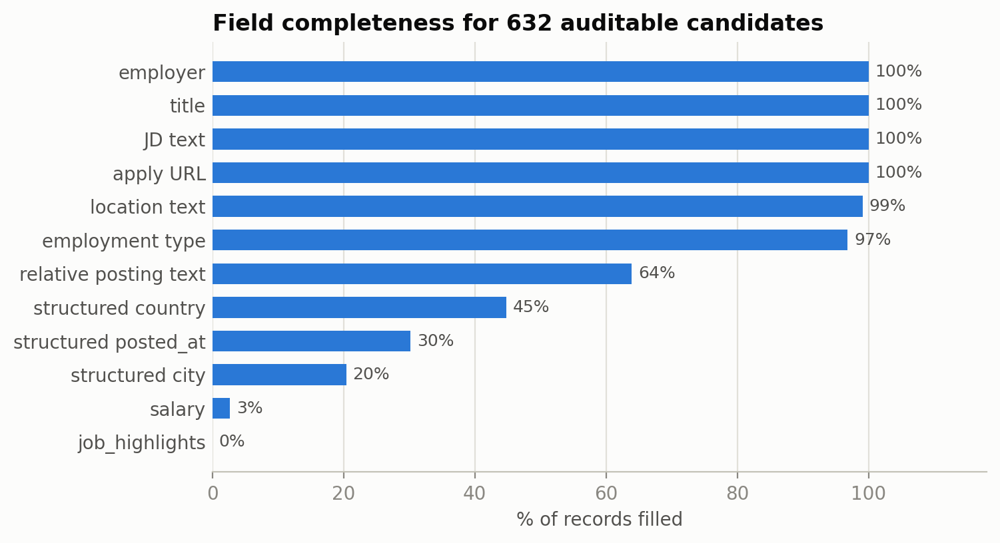
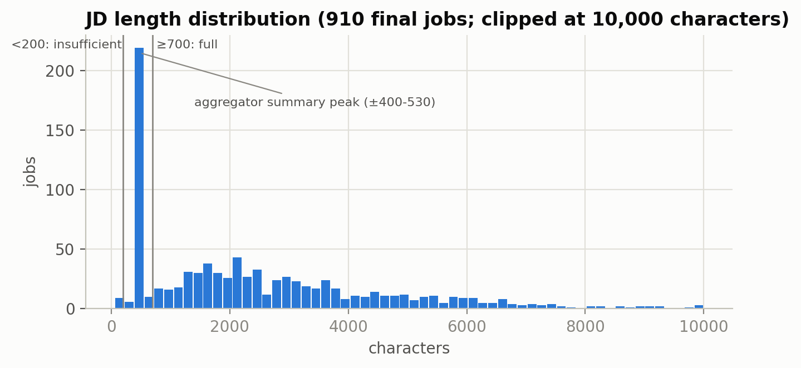

# CP1.3: Data Cleaning and Handling Missing Values

**Status:** the pipeline has been run and audited.  
**Implementation:** notebook section 2, `src/jobfit/jobs/cleaning.py` (moved from `src/jobs/` on 29 Sep 2026), and the dedup snapshot.  
**Version:** `cleaning_v0.1_audited`.

## 1. Goal and principles

Cleaning prepares more consistent text without removing evidence that matters for extraction. Raw data is not overwritten. Empty data is not filled with guesses, and provider values are not assumed to be correct.

**Summary of insights from this stage:**

- JD text is always present, but structured metadata is weak (city 20%, date 30%, salary 3%). Important information has to be taken from the text.
- About 3 in 10 slots are duplicates, and 216 jobs appear more than once. Without dedup, skills from frequently appearing jobs are counted repeatedly.
- Aggregator summary JDs form a peak at 400 to 530 characters, so the skill analysis uses JDs of at least 700 characters.
- Almost a third of jobs (278) have no posting date, and that date is not filled with the data retrieval time.
- No imputation. Empty values stay UNKNOWN.

There are two kinds of decisions: cleaning the form of the text, and choosing candidates for analysis. They are kept separate. Removing tracking codes is cleaning, while holding back short JDs or generic forms is population selection; jobs that do not enter the EDA are still stored in the 910 clusters.

## 2. Completeness audit

The denominator for the table below is **632 EDA candidates**, not all slots or all 910 clusters.

| Field | Filled | Consequence |
| --- | ---: | --- |
| Employer, title, JD, apply URL | 100% | Identity and text are available for audit; not yet evidence that the job is valid/open |
| Location text | 99.1% | Can be normalized, but the publisher location can be wrong |
| Job type | 96.8% | Bilingual labels need to be unified |
| Relative date text | 63.9% | Needs the timestamp from the same response |
| Structured country | 44.8% | Must not be replaced by the query country |
| Structured date | 30.2% | Freshness is limited and the date source must be stated |
| Structured city | 20.4% | Location text is more available than the city field |
| Salary | 2.7% | Not enough for a salary EDA; stays a preference |
| Job highlights | 0% | Requirements are not available as a ready-to-use field |

**Insight:** the information JobFit needs is actually there, but it is mostly stored in the text. For example, structured city is only 20.4%, while location text is 99.1%. This is why JobFit needs a step that extracts from text, using rules in CP1 and then comparing them with an LLM in CP2.

Missingness is not always random. One publisher can give summaries or fewer fields than another. So analyzing only complete data can also change the source mix. We use EDA candidates with an explicit definition and still report the data that was excluded.

## 3. Dedup and text quality

Automatic dedup uses a combination of ID, UID, URL, text hash, and company-title-location. After that, 40 probable pairs were decided by reviewing them against the text evidence. The final result is 910 clusters. A total of 216 clusters appear more than once, with an average of 1.44 slots per job and a maximum of 13 slots in one cluster. 39 jobs appear on more than one publisher. The provider marks all 910 jobs as indirect apply links, including official career pages, so that flag cannot be used to tell official links from aggregators. 27 jobs from publishers with unclear sources are flagged.

This stops one frequently appearing job from dominating skill frequencies. However, similar content can come from different jobs that use the same template. On the other hand, paraphrasing can let duplicates slip through. The 3 UNSURE pairs stay separate and are flagged for re-check.

Length quality is split into full ≥700 characters (667 jobs), summary 200 to 699 (236), and insufficient <200 (7). Most summary JDs come from JobLeads (127 of 236), then Jobrapido (29), Trabajo.org (26), and Jooble (21). The JD length chart shows a sharp peak at around 400 to 530 characters, which is the aggregator summary format that cuts the original description. If these summaries were counted, skills would look rarer just because the text is cut. 35 full JDs with a generic external form are held back. The length threshold is a proxy for completeness, not a check of all requirements. Also, an available link does not prove that the job is still open.

## 4. Cleaning rules and results

| Rule | Clusters affected | Reason |
| --- | ---: | --- |
| Aggregator tracking codes | 75 | Not needed to understand requirements |
| Non-standard spaces | 69 | Makes text matching more consistent |
| Markdown headers | 31 | Tidies the format without removing heading text |
| Email masking | 20 | Reduces personal contacts in derived data |
| Blog template intros | 3 | Reduces opening text unrelated to the job |
| HTML entities | 2 | Turns characters back into text form |
| Indonesian mobile number pattern | 1 | Masks contacts in derived data |

One JD can be affected by several rules, so these numbers are not added up as a count of unique jobs. The module also handles HTML tags and whitespace. Bullet and line structure is kept because it often separates requirements.

Across the 910 clusters, total length changed from 2,279,058 to 2,276,614 characters, a drop of only about 0.1%. Cleaning is kept light on purpose: words like "preferred" or "diutamakan" (preferred) are left in because they are needed later to separate required and optional requirements. The small change fits targeted cleaning, but it is not automatic proof that all meaning is kept. Before/after examples are shown in the notebook; the raw text is still available to compare problem cases.

Example pattern: `Apply: hr@example.co.id / 081234567890 #J-18808-Ljbffr` becomes `Apply: [EMAIL] / [PHONE]`. This is a regression example for masking, not a quote from a real job posting. Masking does not guarantee anonymization of all PII or of all international number formats.

## 5. Dates, language, and job type

### Dates

Across the 910 clusters: **275 provider structured, 357 relative text, 278 UNKNOWN**. Text like “4 hari yang lalu” (4 days ago) must be tied to the timestamp of the record that contains that text. `first_seen_at` is the time the cluster was first observed, and it must not replace that response timestamp.

The median job age when first seen is about 5 days for both date sources, and the oldest is about 30 days. Almost a third of jobs have no date at all. JobFit must not fill it with the data retrieval time, because that is exactly what made JobSentinel show a 3-week-old job as "0 days ago".

The audit cancelled 20 estimated dates that had used the cluster timestamp for manual responses without a retrieval time. UNKNOWN is more honest than a date that looks precise but has no basis. Relative dates are still estimates; a month is assumed to be 30 days. Also, freshness does not prove that a job is open or closed.

### Language and job type

Across all 910 clusters there are 122 JDs in Indonesian, all from the Indonesia group (122 of 565, about 1 in 5). Among the 632 EDA candidates, the language heuristic gives 564 English, 65 Indonesian, 2 mixed, and 1 other script. The number drops from 122 to 65 because 39 Indonesian JDs are too short and 18 use a generic application form. Among Indonesian target jobs, 25 of 175 are in Indonesian. So the gold set and the extractor tests must include Indonesian JDs, so that words like "pengalaman minimal" (minimum experience) or "lulusan baru" (fresh graduate) are not missed.

Bilingual employment values (13 variants plus empty values) are normalized to full_time (797), contract (65), internship (20), part_time (8), or unknown (20). So about 88% of jobs are full-time, 7% contract, and 2% internship. Combined values use the first type; this is a simplification to watch if CP2 needs multi-label values in the data contract.

## 6. UNKNOWN policy and verification

- Dates without enough evidence stay null/unknown.
- Country is not filled from the query, salary is not imputed, and empty highlights are not taken to mean there are no requirements.
- Not detecting a skill or education level does not prove that the job does not ask for it.
- Assertions check unique cluster IDs, date sources, the absence of email patterns, minimum clean text length, and available identity fields.
- Hashes of the raw data and frozen derived files are checked; the offline rebuild matches the snapshot. The audit has 24 regression tests in total, and all pass. They test selected cases; they are not a label accuracy score.

## 7. Outputs and follow-up

Outputs of this stage: [jobs_clean.jsonl](../../data/processed/jobs_clean.jsonl) and [jobs_clean_meta.csv](../../data/processed/jobs_clean_meta.csv). The JSONL keeps the text and provenance; the CSV makes metadata easier to inspect. All outputs are rebuilt by the notebook.

**Acceptance:** before/after is available, dedup and missing-value handling are documented, and there is no silent imputation. Checking whether all links are still active has not been done yet; the freshness limitation is recorded.

Sources: [data contract](../data-contract.md), [audit](supporting/CP1_Research_Audit.md), [notebook section 2](../../notebooks/01_research.ipynb), [summary](../../data/processed/CP1_research_summary.json).

**Next:** [CP1.4: Feature Transformation](CP1_04_Feature_Transformation.md).
