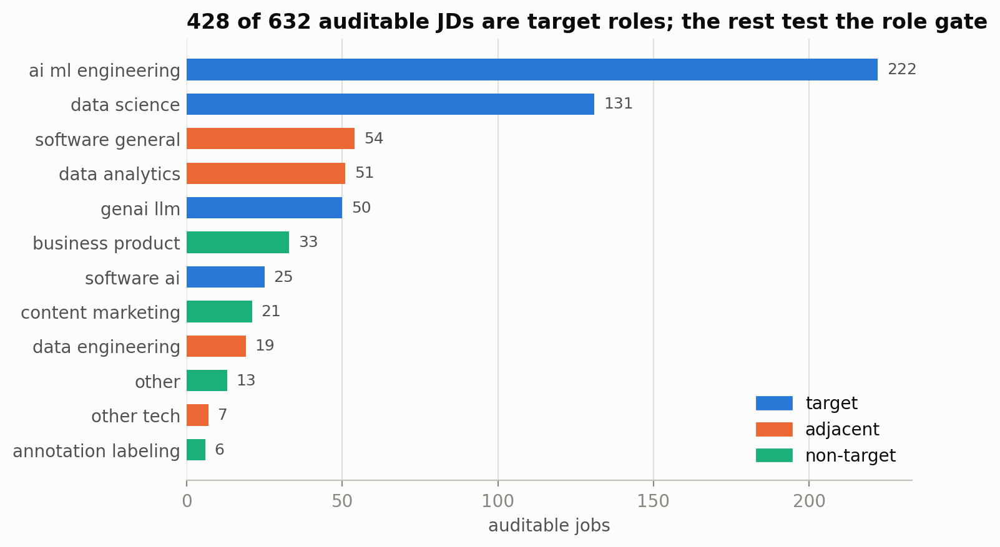
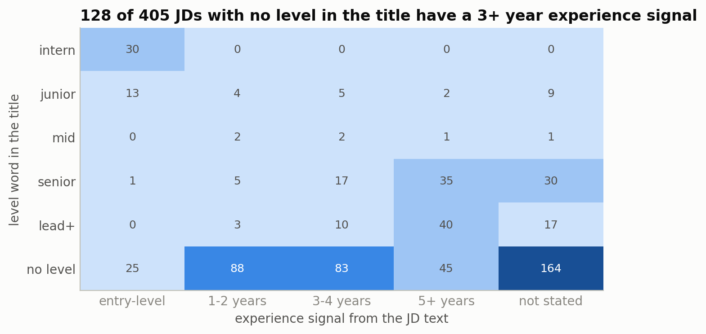
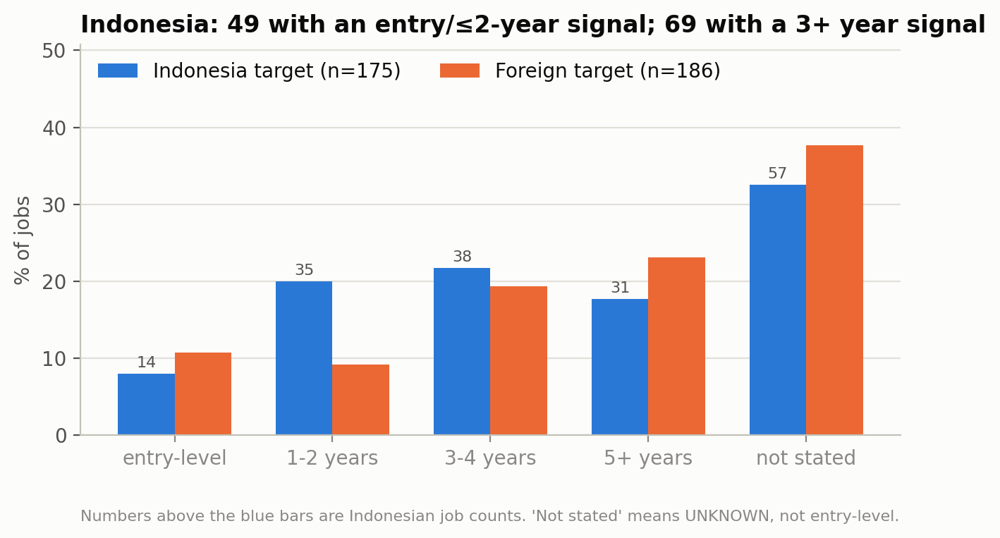
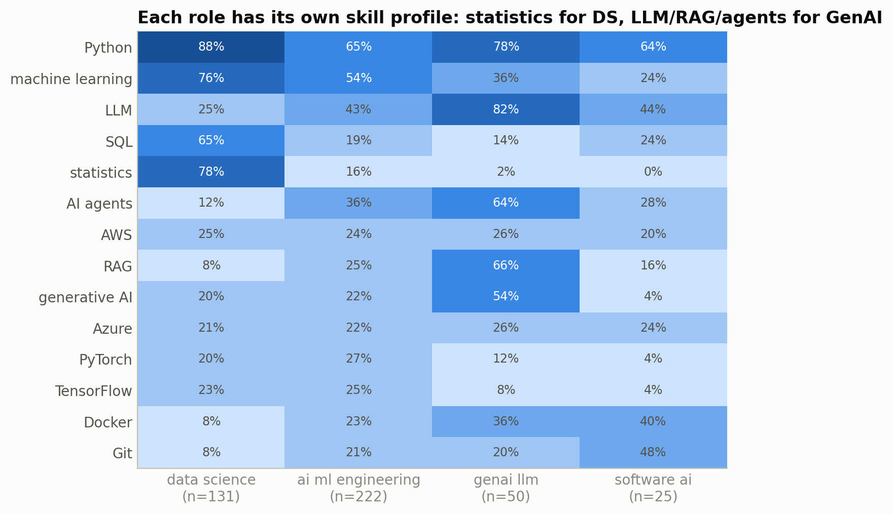
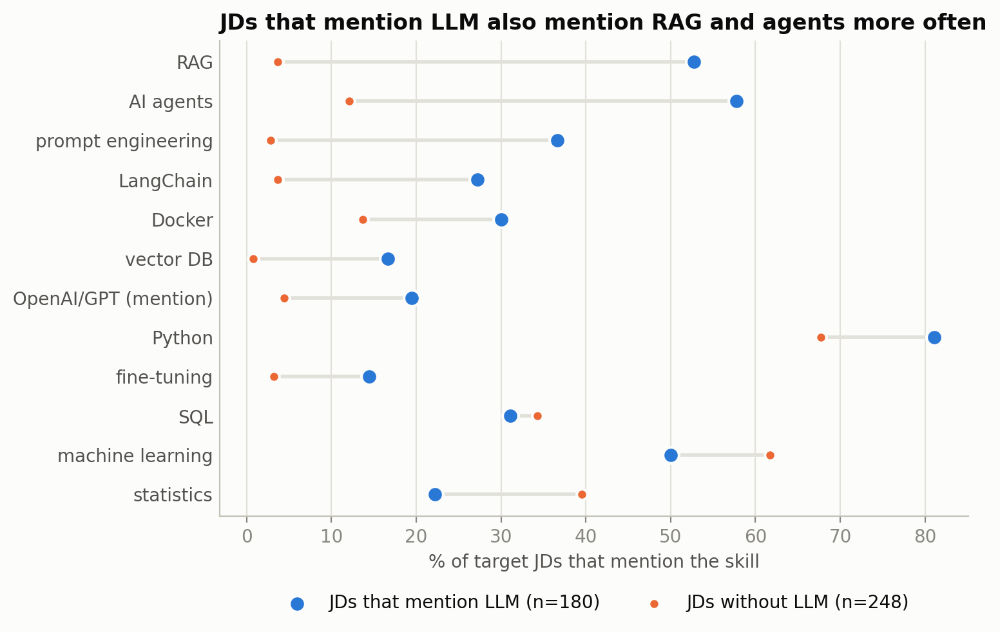
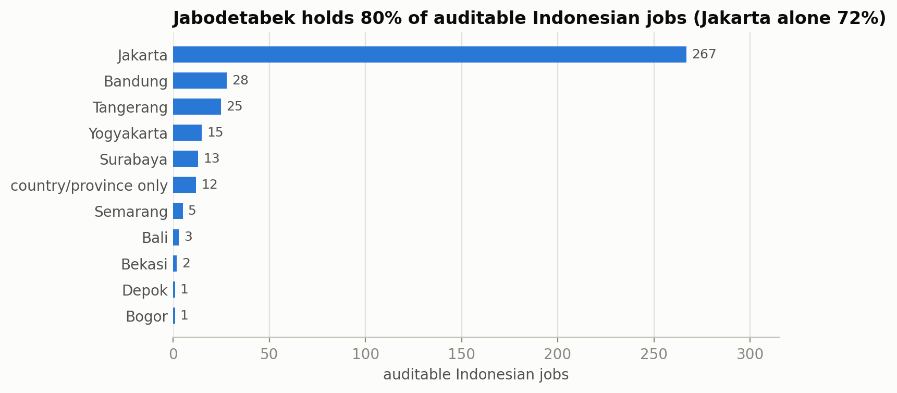
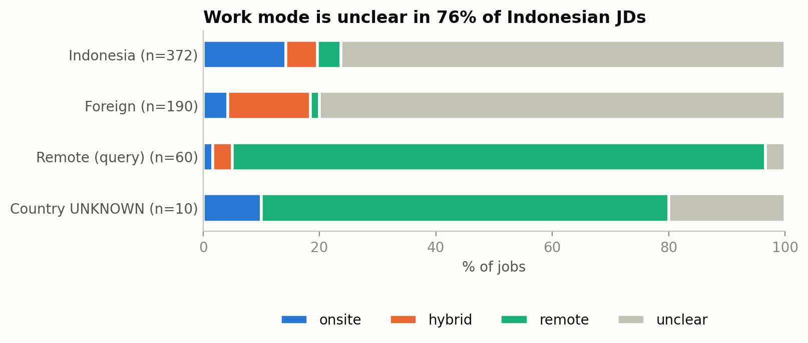

# CP1.5: EDA, Distributions, and Data Visualization

**Status:** descriptive EDA complete on snapshot `CP1_20260926`.  
**Source of numbers:** [summary JSON](../../data/processed/CP1_research_summary.json), [notebook section 4](../../notebooks/01_research.ipynb).  
**How to read:** numbers are frequencies in a query-based sample, with rule-based v0 labels (their accuracy will be measured against the CP2 gold set).

## 1. Populations and analysis rules

AUD contains 632 candidates; TGT contains 428 target-role jobs. TGT is split into mutually exclusive groups: ID_T=175, FOR_T=186, REM_T=57, and UNKNOWN_T=10. The role and skill-per-family charts use TGT; the country comparison uses ID_T and FOR_T; the city chart uses the 372 Indonesian candidates across all roles.

Keeping these denominators separate matters. For example, 49/175 is the early-career pool among Indonesian targets, while 37/49 describes the titles inside that pool. Using 632 as the denominator for both would answer different questions.

## 2. Role composition and AI titles

Targets consist of AI/ML engineering 222, Data Science 131, GenAI/LLM 50, and software AI 25. There are 204 adjacent/non-target jobs as comparison roles. 197 of the comparison roles come from Indonesia because of the query design, so the gate evaluation later needs to take that composition into account.

Across the 910 clusters, 49 of 463 AI titles are non-target according to the rules. The insight is not that the word AI is bad, but that the same keyword can stand for different job functions. Wrong-role examples are useful for testing the gate; the final decision must be backed by the JD content and gold labels.

## 3. Early-career pool and seniority titles

| Experience signal, Indonesian targets | Count | Percentage of 175 |
| --- | ---: | ---: |
| Entry | 14 | 8.0% |
| Minimum 1-2 years | 35 | 20.0% |
| Minimum 3-4 years | 38 | 21.7% |
| Minimum 5+ years | 31 | 17.7% |
| Not detected | 57 | 32.6% |

The early-career pool is 49/175, or 28%. If we picture 10 target jobs in Indonesia, about 3 could be options for a beginner, 4 mention 3+ years, and 3 are unclear. Without a seniority gate, 4 of the 10 jobs shown to a beginner are actually too senior. Foreign jobs are harder for beginners: the early-career pool is only about 20% (entry 10.8% and 1-2 years 9.1%), while 42.5% mention 3+ years.

69 Indonesian target jobs have a 3+ signal, but not all of these are mandatory requirements. UNKNOWN is also not automatically beginner-friendly. So this result helps decide what the extractor needs to read; it does not directly decide who is eligible to apply.

Across all EDA candidates, 128/405 JDs with no level word have a 3+ year signal. On the other hand, 37/49 in the early-career pool have no level word; only 11 are junior/intern and 1 is mid. In contrast, senior and lead titles are fairly consistent: only 6 of 88 senior jobs and 3 of 70 lead+ jobs have a signal of 2 years or less. A junior title is not always safe, because 7 of 33 mention 3+ years. So errors can go in two directions: jobs that are too senior look safe, and jobs that fit beginners stay hidden because they do not say "junior". The title is not enough to find or reject candidates. A literal level filter risks missing many pool members, but we have not measured the recall of the API search engine.

## 4. Common skills and skills per role

In ID_T, the top 10 skills are Python 65.1%, machine learning 42.3%, LLM 35.4%, SQL 35.4%, AWS 24.6%, statistics 24.0%, AI agents 23.4%, Azure 22.9%, Docker 22.3%, and Git 21.1%. After Python, demand splits into three directions: ML and data, LLM and GenAI, and cloud and tooling. 49.1% mention at least one skill in the GenAI group defined in the notebook (59.7% abroad). This supports covering GenAI aliases; it is not a claim that half of the jobs require the full GenAI stack.

Differences between roles are more informative than the combined list (all 428 targets):

| Role (n) | Most prominent skills | Rare skills |
| --- | --- | --- |
| Data science (131) | Python 88%, statistics 78%, machine learning 76%, SQL 65% | RAG 8%, AI agents 12% |
| GenAI/LLM (50) | LLM 82%, Python 78%, RAG 66%, AI agents 64%, generative AI 54% | statistics 2% |
| AI/ML engineering (222) | Python 65%, machine learning 54%, LLM 43%, AI agents 36% | mix of ML and GenAI |
| Software AI (25) | Git 48%, LLM 44%, Docker 40% | machine learning 24% |

The pattern in Indonesia is the same: Indonesian data science jobs mention statistics 78% and SQL 65%, while Indonesian GenAI/LLM jobs mention LLM 75% and RAG 62%. As an example of the impact, a future data scientist could be wrongly advised to learn RAG if the advice came from the combined numbers, even though only 8% of data science JDs mention it. Skill advice that is relevant for one family may not be relevant for another.

Implication: the user picks a target role first, then gaps are read against relevant jobs and CV evidence. High frequency can help prioritize what to explore, but it does not automatically mean one skill is the most important for everyone. The mix of countries, publishers, and levels still limits interpretation.

Supporting chart: [fig07, top skills in Indonesia](../../reports/figures/cp1/fig07_top_skills_indonesia.png).

## 5. GenAI skill bundle

The comparison uses 180 JDs that mention LLM and 248 that do not, out of all 428 targets.

| Skill mentioned | With LLM | Without LLM |
| --- | ---: | ---: |
| RAG | 53% | 4% |
| AI agents | 58% | 12% |
| Prompt engineering | 37% | 3% |
| Docker | 30% | 14% |
| LangChain | 27% | 4% |
| Vector DB | 17% | 1% |
| Statistics | 22% | 40% |
| Machine learning | 50% | 62% |

JDs that mention LLM mention RAG about 13 times more often and AI agents almost 5 times more often. In contrast, statistics and classic ML are mentioned less often. This pattern shows groups of terms that often appear together. Gap explanations can be tested with grouping, for example when LLM evidence exists but RAG evidence does not. However, only about half of LLM JDs mention RAG, so it is not correct to say the two are always required together. Docker is also not evidence that all LLM positions require production deployment.

Ontology v1 stays a light alias list. Co-mention is a hypothesis for explanations; it does not automatically require a knowledge graph or add new blockers.

## 6. Indonesia versus foreign: results and sensitivity test

Foreign target JDs are longer: a median of 3,538 characters, compared with 2,420 in Indonesia. The average number of detected skills is also higher, 9.0 versus 7.6. So raw skill differences may be affected by the text simply having more chances to mention more terms.

The notebook compares raw numbers, a length restriction of 1,500 to 4,000, and then direct standardization by role × five length bins. The last step uses pooled composition weights on cells that have at least 3 JDs per region. Common support covers 151/175 ID_T and 172/186 FOR_T across 12 cells. Software AI has no cell that meets the condition.

| Difference, Indonesia minus foreign (percentage points) | Raw | Length 1,500 to 4,000 | Adjusted |
| --- | ---: | ---: | ---: |
| SQL | +6.4 | +5.8 | +8.8 |
| Machine learning | -24.4 | -27.2 | -23.7 |
| Statistics | -17.4 | -12.0 | -11.4 |
| PyTorch | -9.8 | -6.4 | -10.6 |
| LLM | -10.8 | -12.4 | -2.1 |
| AI agents | -10.4 | -7.4 | -3.3 |
| RAG | -4.7 | -8.4 | +3.2 |

**What holds:** the SQL/ML pattern is still visible after adjusting for composition. Indonesian job profiles lean more toward data and practical engineering. **What does not hold:** the LLM and agents gaps shrink, and RAG changes direction. This means the GenAI gap in the raw comparison mostly comes from role composition and the longer foreign JDs. The broad conclusion “GenAI is lower in Indonesia” is not stable.

Standardization does not control for everything: length within a bin, employer, publisher, language, and seniority still differ. The result is descriptive for the common support; it is not a causal claim, a claim of statistical significance, or a claim about the whole national market.

Supporting chart: [fig10, raw comparison](../../reports/figures/cp1/fig10_skills_id_vs_foreign.png). The adjusted table and the full weights are in the notebook/summary, not in the raw points of the chart.

## 7. Location, work mode, and early-career pool profile

Of the 372 Indonesian candidates across all roles, 79.6% have a publisher location in Jabodetabek (Greater Jakarta); Jakarta is 267/372, or 71.8%. This can reflect where jobs are concentrated, but also the query pattern and provider coverage. It is not enough to conclude that other cities have no opportunities.

Work mode is unclear for 76.3% of Indonesian candidates (80.0% abroad). Clearly stated modes in Indonesia are only onsite 14.2%, hybrid 5.4%, and remote 4.0%. If a user picks "remote only" and everything unclear is rejected, about 3 in 4 jobs disappear just because the JD does not state it. That value combines unknown and remote_mentioned; the word remote in a JD does not always describe the work policy. A hard filter on unclear data can cut options without a real basis.

The early-career pool of 49 comes from 49 companies: AI/ML engineering 26, Data Science 15, software AI 6, GenAI 2; 40 are in Jabodetabek. Only 2 of 16 Indonesian GenAI/LLM jobs are in the pool, but 16 is too small to conclude that the GenAI market is closed to beginners. Python is mentioned in 34/49, SQL in 24/49, and ML and LLM in 18/49 each. Bachelor is mentioned in 28/49, master in 6/49, diploma in 3/49, and 19 do not mention a level. For comparison, master/S2 is mentioned in 23% of Indonesian 3+ year jobs and 27% of foreign jobs, much more often than in the early-career pool (12%). Education lists can overlap and are not yet split into required/preferred. 30 of the 49 pool jobs are still in the review queue, all because of the words "preferred", "or", or "atau" (or) in the experience quote.

SQL is mentioned more often in this pool (49.0%) than in all of ID_T (35.4%). This gives a direction to explore, not a cause-and-effect result of seniority, because the role and publisher mix also differs. The pool also does not check CVs, work permits, or all other requirements yet.

Supporting chart: [fig13, skills in the early-career pool](../../reports/figures/cp1/fig13_realistic_pool_skills.png).

## 8. Sources and limits of generalization

There are 109 publishers, but the top five contribute 54.4% of EDA candidates. Aggregators can inherit information from the same source; many publishers do not automatically mean many independent sources. Dedup reduces repetition but does not remove coverage bias.

Supporting chart: [fig14, publishers](../../reports/figures/cp1/fig14_publishers.png). Fig01 to Fig03 are shown in the CP1.1 and CP1.3 reports. All 14 figures are in `reports/figures/cp1/`; the key ones are shown in this report. Posting age is still covered in notebook 2.6, without an extra figure.

**Acceptance:** every analysis has a question, population, result, implication, and limits. The EDA supports evaluation preparation; it does not prove model accuracy or market representativeness.

**Next:** [CP1.6: Insights and Design Decisions](CP1_06_Insights_and_Design_Decisions.md).
