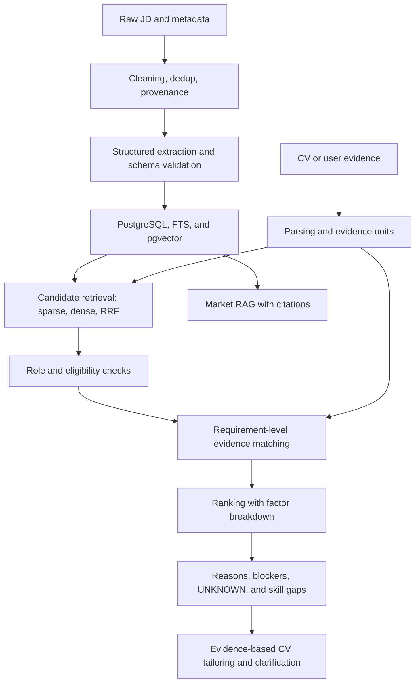

# CP1.6: Insights and Preprocessing Documentation

**Status:** CP1 synthesis complete; the architecture below is a proposal in line with the Canonical, not an evaluated system.  
**Next stage:** CP1.7, presentation and mentoring. Slides are not made in this report package.

## 1. Main conclusions

The corpus gives enough material to understand the failures JobFit must prevent: wrong roles even with AI in the title, titles that do not explain the experience needed, incomplete metadata, and skills that differ between families. A large number of candidates does not automatically produce correct recommendations.

So the next goal is not to add data just to reach 1,000. The priority is to test whether requirements can be extracted correctly, paired with CV evidence, and then used to produce a ranking that is more useful than similarity alone.

## 2. Finding → decision → how to test it

| CP1 evidence | Meaning | Decision/hypothesis | Next validation |
| --- | --- | --- | --- |
| 49/463 AI titles are non-target according to the rules | The AI keyword is not enough to understand the job function | The role gate needs the family and task evidence | Wrong-role gold set; measure the false-positive rate |
| 128/405 with no level have a 3+ signal | The title is a weak proxy for experience | Extract the experience requirement; the title is an extra signal | Required/preferred, multi-level, and seniority negatives |
| Early-career pool 49/175; 57 with UNKNOWN experience | Not every relevant role is a direct fit | Qualification separate from preference; clarify unknowns | Evidence Macro-F1, usefulness, and ranking |
| 37/49 in the pool have no level in the title | A literal filter can be too narrow | Compare retrieval methods; do not depend on the word junior | Recall@10/20/50 on a labeled pool |
| Statistics 78% in DS vs 2% in GenAI | The skill profile depends on the role | Insights per family; gaps from requirements and the CV | Test extraction and the usefulness of explanations |
| RAG 53% with LLM vs 4% without LLM | Co-mention can help grouping | Test explanations of related skills; ontology stays light | Evaluate usefulness; not turned into an automatic blocker |
| SQL +8.8 and ML -23.7 points after adjustment | Some regional patterns hold, not all | Separate regions and show denominators | Sensitivity, label audit, and source bias |
| Weak date/city/salary metadata | An empty field does not mean the requirement does not exist | Provenance and explicit UNKNOWN | Schema validation and missing-data cases |
| Query location can be wrong; remote is not verified yet (3/85 mention Indonesia, 11/85 limited to other countries) | Geographic relevance needs evidence | The eligibility gate uses known constraints; remote is not automatically eligible | Gold labels for location, work permits, and conflicts |
| 79.6% of Indonesian candidates are in Jabodetabek (Greater Jakarta); work mode is unclear in 76.3% | Few options outside Jabodetabek; work mode is rarely stated | Location is checked as eligibility; work mode is a soft preference with UNKNOWN | Location and preference labels |
| 25/175 Indonesian target JDs are in Indonesian | English dictionaries and prompts can miss requirements | The skill dictionary and extractor are tested in both languages | Gold set with Indonesian and English JDs |

This table makes the direction of the experiments clearer. Its content is the same as the decision table in notebook section 5.2. Ranking weights, the LLM model, embeddings, chunking, and the semantic evidence threshold are still not final.

### What is fact, hypothesis, and target

When presenting, these three kinds of statements must be kept apart, because their evidence status is different:

| Type | Example |
| --- | --- |
| **Fact from CP1** (computed in the notebook) | 49 of 175 Indonesian target jobs have a ≤2 year signal. 128 of 405 JDs without a level mention 3+ years. |
| **Design hypothesis** (expected to help, not proven yet) | A seniority gate based on JD content will reduce too-senior jobs in the top results. Grouped gap explanations are easier to understand. |
| **CP2 target** (to be measured) | Precision@5, NDCG@10, wrong-role and seniority false-positive rate, and extraction F1. |

## 3. Preprocessing rationale that is kept

- Raw data and metadata are kept so every result can be traced, instead of just trusting the final table.
- Dedup uses more than job_id, because one job can appear in several queries/publishers. The pair decisions were reviewed against the text evidence; dedup is still v0, and the 3 UNSURE pairs are flagged for re-check.
- The length threshold separates EDA candidates consistently, but it does not replace checking whether a JD is complete.
- Posting date, response timestamp, and first/last seen are kept separate so a job's age is not made to look new.
- Light cleaning keeps the text structure and evidence. Contact masking is not full anonymization.
- Rule-based features become a baseline that can be compared with an LLM, with versions and evidence spans.
- UNKNOWN stays in the data and the analysis. Dropping all rows with missing values would change the population and hide source problems.

## 4. Proposed v0 architecture

The diagram shows the logical flow, not a final query/database implementation. Safe constraints can be used during retrieval; qualification checks must still use evidence. Unknown values are not forced into a match or an automatic rejection.

Python/SQL handles deterministic counting, filtering, arithmetic, and scoring. The LLM is used selectively for language understanding and grounded explanations. FastAPI is the service, Streamlit is the UI, and PostgreSQL/pgvector stores the data and index, as set in the Canonical. CV data is processed within the privacy limits already set.

Market RAG and tailoring are still part of the v1 scope, but they are not claimed as built in CP1. A reranker, a second provider, an agent framework, and a knowledge graph are not new needs that automatically follow from the charts.

## 5. CP2 experiment plan

| Experiment | Baseline/candidate | What is recorded |
| --- | --- | --- |
| Extraction | CP1 rules vs LLM structured output; prompt v1/v2 | P/R/F1, schema validity, failures, latency/cost |
| Retrieval | Keyword, PostgreSQL FTS, dense; then hybrid RRF | Recall@10/20/50, query failures, latency |
| Evidence | Exact/alias baseline and semantic verifier | Macro-F1, confusion matrix, evidence span |
| Ranking/gates | Similarity-only vs qualification/evidence and gates | P@5, NDCG@10, hard-negative FP rate |
| RAG | Retrieval + grounded answer | Correctness, citation/coverage, and refusal |
| CV safety | Evidence validator + clarification | Unsupported claim target 0; coverage target 100% on the frozen test |

Before the experiments: define the labels, split, metric denominators, model/prompt versions, and configuration. Gold targets follow the Canonical: ±50 JDs for extraction, ±100 evidence pairs, 40-60 jobs for ranking, 15-20 RAG questions, and 20-30 CV safety scenarios.

Cases already used to fix the rules go into development/regression. The held-out test is frozen separately and is not used to choose prompts. Small sizes need reporting of error examples and case counts, not percentages without denominators. A more complex model is kept only if its measured benefit is worth its cost and latency.

## 6. Initial risk register

| Risk | Impact | Existing / planned mitigation | Status |
| --- | --- | --- | --- |
| Query/provider/publisher bias | Insights do not represent the market | Explicit denominators and strata; avoid population claims | Open, documented |
| False merges / remaining duplicates | Biased frequencies and evaluation | Raw/provenance stored; 40 pair decisions; the 3 UNSURE pairs flagged for re-check | Dedup still v0 |
| Preferred/multi-level misread | Beginners wrongly rejected or passed | Evidence span, review queue, CP2 required/preferred gold | Not resolved yet |
| Wrong location/remote | Recommendations cannot be applied for | Separate query and location, UNKNOWN/conflict, eligibility gold | Needs validation |
| Stale JD or doubtful source | Recommendations cannot be trusted | Date source, source link, and form filter; lifecycle later | Active status not fully verified |
| Leakage from already-fixed examples | Evaluation scores too optimistic | Development/regression kept separate from test | Gold split not created yet |
| LLM hallucination/prompt injection | Unsupported requirements/CV claims | Untrusted JD/CV, schema, citations, validator, clarification | To be tested in CP2/deployment |
| PII and data distribution | Privacy/terms of use | Limited masking; raw data not published without review | Not full anonymization |
| Quota, timeouts, and cost | Collection/demo disrupted | Cap, provenance, offline snapshot; latency/cost per flow | CP1 collection closed |

## 7. Decision status and questions for the mentor

**Fixed:** Indonesia-first, evidence-grounded matching, qualification separate from preference, explicit UNKNOWN, one CP1 notebook, collection closed. **Provisional:** JSearch for the corpus. **Experiment-gated/OPEN:** model, embedding/chunking, ranking weights/thresholds, reranker, and final provider.

Questions to bring to the mentor at CP1.7:

1. Does the evaluation priority of extraction → evidence/ranking fit the scope and the time available?
2. Is the gold set and split design adequate for a demonstration, with the limits of generalization explained?
3. How should the human relevance rubric separate realistic, stretch, and blocker without treating unknown as a match?
4. Is the trade-off on source coverage and the deferred Techmap acceptable for CP1 with the current documentation?

These questions were written before the mentor session on 27 September 2026. The mentor's feedback is summarized in 03_Checkpoint_1 and followed up in System Design v1.2.

## 8. Evidence and acceptance

Reports [CP1.1](CP1_01_Dataset_Selection_and_Exploration.md) to [CP1.5](CP1_05_EDA_Distribution_and_Visualization.md), [notebook section 5](../../notebooks/01_research.ipynb), the [summary](../../data/processed/CP1_research_summary.json), the [audit](supporting/CP1_Research_Audit.md), and the Canonical form the chain data → insight → decision/experiment.

**Acceptance:** 5 to 10 main insights are summarized, bias and preprocessing rationale are recorded, and the proposed architecture and experiment plan are available. A finished report does not mean that the gold set, model evaluation, or the app is finished.
