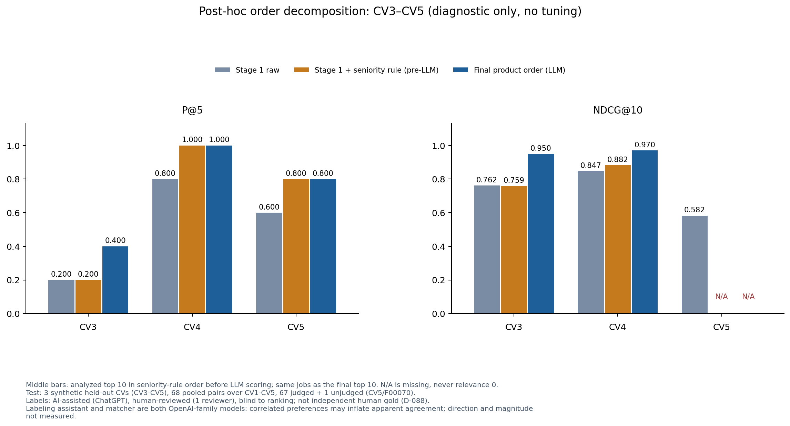

# CP2.5: Evaluation Result Visualization

**Actual date:** 4 October 2026 (development), 7 October 2026 (held-out). **Status:** DONE. Development figures 1-8, held-out figures 9-11 (Dion's notebook run, 7 Oct) and Phase A figures A1-A4 are ready; see the sections at the end. Pipeline v1.1 reached 42 of 60 final or provisional development scores under H2, below the 54 of 60 target. The official checkpoint date remains in the master plan.

## Summary

**Current (7 October 2026):** figures 1-8 are development results. Figures 9-11 are the CP2.4 held-out result: the CV3-CV5 headline (figure 9), the CV1-CV2 supplementary view (figure 10) and the post-hoc decomposition (figure 11). Figures A1-A4 are Phase A, on development data. Each held-out figure states its split, its coverage (NDCG@10 covers 2 of 3 CVs) and the D-088 label provenance. The receipt hashes were rechecked in the [closeout audit](CP2_Closeout_Audit_20261007.md#7-notebooks).

## Development figures (4 October 2026)

This section and the next three are the 4 October text, kept as written. When they say no held-out result is shown and the final-order chart is unavailable, that was true on 4 October; the held-out sections at the end replace those statements.

Six comparison figures present retrieval, embedding, LLM quality, evidence errors, guardrails and cost/latency. A seventh shows original Part B coverage. An eighth compares H1 and H2 pipeline v1.1 coverage on the same 60 pairs. Each caption states the split and denominator or measured planning basis. No held-out test result is shown. The stage-1 versus final-order chart remains unavailable: the gold-input exercise lacks A/B for 104 distinct CV/JD pairs in the top-30 union, and every pipeline v1.1 top-K contains held or failed analyses.

## Goal and inputs

The goal is to make CP2.3 choices and limits legible. Inputs are the fixed 214-JD development universe, two synthetic development CVs, reviewed relevance labels, seven JD extraction references, four evidence pairs with 73 units, D-067's SQL reference and the saved provider ledger. The [figure script](../../scripts/build_cp2_figures.py) reads saved JSON measurements only and performs no model inference.

## Figures and interpretation

| Figure | What it shows | Main reading and limit |
| --- | --- | --- |
| [Retrieval methods](../../reports/figures/cp2/fig01_retrieval_methods.png) | P@5, NDCG@10 and labeled-pool Recall@20 for six methods | Hybrid Qwen leads Recall@20; B0 has better P@5. Only two CV queries. |
| [Embedding comparison](../../reports/figures/cp2/fig02_embedding_recall20.png) | OpenAI versus Qwen within dense and hybrid | Qwen wins D-044's pre-registered Recall@20 rule in both method pairs. |
| [LLM quality](../../reports/figures/cp2/fig03_llm_quality.png) | Seven-JD extraction F1 and 73-unit evidence Macro-F1 | DeepSeek Flash is the D-068 provisional choice. GPT-6 Sol is a four-pair matching quality reference only. |
| [Evidence confusion](../../reports/figures/cp2/fig04_matching_confusion.png) | DeepSeek Flash after v1.1, D-067 and G1/G2 | MATCH versus PARTIAL remains imperfect. |
| [Guardrail effect](../../reports/figures/cp2/fig05_guardrail_effect.png) | Before/after G1/G2 under the revised SQL reference | Two DeepSeek scope overclaims still remain. |
| [Cost and latency](../../reports/figures/cp2/fig06_cost_latency.png) | Linear K=10, 20 and 30 cached-JD matching-cost projections, plus observed request p95 | DeepSeek's p95 is about 91 seconds per pair, requiring Part B wall-time measurement. |
| [Part B coverage](../../reports/figures/cp2/fig07_partb_coverage_20261004_v1.png) | Score status for all 60 saved development pairs, 30 per CV | Only 20 final scores. Holds and failures are not zero scores. |
| [Pipeline v1.1 coverage](../../reports/figures/cp2/fig08_pipeline_v11_coverage_20261004_v3.png) | Same 60 pairs before and after technical changes, H1 and provisional H2 separately | H2 reaches 42/60, short of the 54/60 target. The v1 H2 bar is an offline counterfactual. |

The [K=20 projection](../../evals/results/cp23_k20_cost_projection_20261004_v1.json) uses observed cost per JD and per CV/JD pair. With cached JD extractions, matching alone is estimated at US$0.203 for DeepSeek Flash, US$0.036 for GPT-6 Luna and US$0.838 for GPT-6 Sol per K=20 CV run. If all 20 JD extractions are uncached, extraction plus matching is about US$0.463, US$0.085 and US$1.589 respectively. These exclude CV parsing, embeddings, repairs, hosting and load effects.

## Checks and limitations

Every figure is produced from saved result inputs, and no chart treats an unjudged job as irrelevant. Figure 3 leaves GPT-6 Sol extraction blank because its four-JD extraction alignment is not accepted on the seven-JD comparison scope. Figure 5 includes Gemini and Claude with incomplete process-valid matching coverage; their bars include unassessed false negatives. Calculation details are in the [A1/A2 report](supporting/CP23_Validator_v11_and_A2_Proposal_20261004.md), [retrieval result](../../evals/results/cp23_stage3_retrieval_evaluation_20261003_v2.json) and [Gemini adjudication](../../evals/results/cp23_gemini_f00815_alignment_20261004_v1.json).

These figures are suitable for a CP2 presentation only when explicitly labeled **development**. They do not satisfy frozen-test visualization or final-order comparison. The [pipeline v1.1 evaluation](../../evals/results/cp23/pipeline_v11/evaluation_v2.json) has zero complete final-order metric cells across 36 CV/K/weight/H1-or-H2 settings; a score-order quality chart or winner would be misleading. Held-out test figures waited for D-053 (now done: see below).

## Held-out test figures (CP2.4, 7 October 2026)

Notebook: [`notebooks/02_cp2_heldout_evaluation.ipynb`](../../notebooks/02_cp2_heldout_evaluation.ipynb), run by Dion on 7 October 2026 (Python 3.11.16, pandas 2.3.3, matplotlib 3.10.6). It reads the saved report, run files and labels only; it first rebuilt the report with the frozen `build_report` and printed "Report reproduced from labels: OK" (67 judged, 1 unjudged CV5/F00070). Tables and a sha256 receipt are in `evals/results/cp24/cp25_tables_v1/` (`per_cv.csv`, `group_macros.csv`, `order_decomposition_posthoc.csv`, `receipt.json`).

| Figure | What it shows | Coverage and limit |
| --- | --- | --- |
| [Fig 9 Held-out headline](../../reports/figures/cp2/fig09_cp24_heldout_primary_v1.png) (sha256 `d67b62fbd445`) | Stage 1 vs final P@5 and NDCG@10 for CV3, CV4, CV5 | P@5 macro 0.533 -> 0.733, 3/3 CV complete. NDCG@10 macro 0.805 -> 0.960, **2/3 CV complete (CV3, CV4 only)**; CV5 final NDCG is shown as unavailable, not 0 |
| [Fig 10 Supplementary](../../reports/figures/cp2/fig10_cp24_supplementary_familiar_v1.png) (sha256 `44a49421d251`) | CV1-CV2 only | Diagnostic; never pooled with CV3-CV5 |
| [Fig 11 Order decomposition](../../reports/figures/cp2/fig11_cp24_order_decomposition_v1.png) (sha256 `988a1e104120`) | Raw stage 1, stage 1 + seniority rule (pre-LLM), final LLM order | Post-hoc diagnostic, not headline, used for explanation only |

Every held-out figure carries the same caption facts: 3 synthetic held-out CVs, 68 pooled pairs, 67 judged + 1 unjudged; labels AI-assisted, human-reviewed, blind to ranking (D-088); and the OpenAI-family limitation in the D-088 wording.

**Figure 11 reading (CV3-CV5).** P@5: CV4 (0.8 -> 1.0) and CV5 (0.6 -> 0.8) already reach their final value with the seniority rule alone, before any LLM call; only CV3 (0.2 -> 0.4) gains from the LLM order. NDCG@10: the seniority rule changes little (CV3 0.762 -> 0.759, CV4 0.847 -> 0.882); the LLM order lifts CV3 to 0.950 and CV4 to 0.970. So the P@5 gain is mostly the rule, and the NDCG gain is mostly the LLM order. The LLM-order part is exactly where the OpenAI-family correlation risk applies.

**Note on figure 9 after the offline supplement (CP2.4 section 10b, FAIL-34):** 14 of 44 Sol calls in the test run were refused by the runner's own cost cap and went to the Luna fallback (11) or became holds (3). The bars are the system as run, fallback included. Three of CV5's unscored jobs come from that cap.

### Short cases (master-plan step 5: hard negatives and failures)

| Case | What happened | Why it matters |
| --- | --- | --- |
| CV3 / F00501 (relevance 0) at final position 5 | A Data Engineer post outside the four target families; the CV has adjacent ML/data-platform evidence, so evidence coverage is high | The match percentage measures evidence coverage, not role fit; role-family fit is a known limit of the score (CP2.6) |
| CV5 / F00070 (unjudged) at final position 6 | The JD has responsibilities only; no requirement could be extracted (no score) and no label could be given (D-088) | A missing judgment is never 0; CV5 leaves the NDCG macro |
| CV5 / F00071 (relevance 3) held | Sol call refused by the run cap; Luna failed its duration validation (FAIL-34) | An operational guard, not the model, removed the most relevant CV5 job from the scored list |
| CV3 / F00480 held | JD extraction failed schema validation after its one repair (FAIL-33) | Held jobs sit last and are never scored as 0 (D-073) |
| CV1 / F00258 (relevance 3) held | One required unit could not be judged (needs clarification) | H2v2 holds a job when required evidence is unclear instead of guessing |

### Phase A figures (CP2.8, development only)

Rendered by Dion's run of [`notebooks/03_post_test_quality_optimization.ipynb`](../../notebooks/03_post_test_quality_optimization.ipynb) and saved without re-plotting from the notebook outputs (`reports/figures/phase_a/receipt_v1.json`). They are development results, not held-out results.

| Figure | What it shows | Denominator and limit |
| --- | --- | --- |
| [A1 failure taxonomy](../../reports/figures/phase_a/figA1_failure_taxonomy_v1.png) (`08a03b7501ce`) | Baseline errors: anchor unit errors, unit items not judged, ranking discordance | 73 anchor units; 60 saved pairs; 20 analyzed pairs (separate denominators) |
| [A2 baseline repeatability](../../reports/figures/phase_a/figA2_baseline_repeatability_v1.png) (`2972e1211bc1`) | R1 to R2 label transitions and change rate per field | 411 units; location has 1 unit, so its full bar is one unit |
| [A3 Wave 1 comparison](../../reports/figures/phase_a/figA3_wave1_comparison_v1.png) (`a56fc8432f20`) | Macro-F1, unsupported positives, ranking NDCG@10 | 411 units per run; ranking only for QA-E01 (QA-E02 stopped at Stage A); the macro-F1 axis starts at 0, so read the values in CP2.8 |
| [A4 QA-E02 trade-off](../../reports/figures/phase_a/figA4_e02_precision_recall_tradeoff_v1.png) (`315cbb4fb1f7`) | Overclaims, underclaims, unsupported positives: baseline mean vs QA-E02 | 411 units |

### Master-plan step check (CP2.5)

| Step | Status |
| --- | --- |
| 1. Stage-1 comparison chart (Recall@K per method) | Done on development: figure 1 (labeled-pool Recall@20, six methods) |
| 2. NDCG@10 and P@5: stage-1 vs final order | Done on the held-out test: figures 9 and 11 (figure 10 supplementary) |
| 3. Evidence confusion matrix | Done on development: figure 4 (test evidence gold not available, CP2.4 10b) |
| 4. Quality vs cost vs latency | Development: figure 6; test cost and latency as a table in CP2.4 10b |
| 5. Hard-negative and failure cases | Short cases table above |
| Acceptance: every chart shows configuration, version and denominator | Figures 1-11: in the caption or this report. Phase A figures A1-A4 come straight from the notebook and carry them only in this report |
| Acceptance: comparisons use the same split and labels | Yes: figures 9 and 11 use one split and one label set; Phase A uses one development benchmark |
