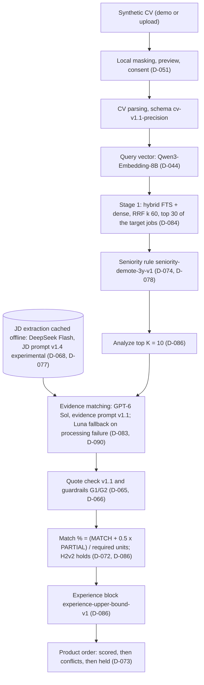

# CP2.6: Recommendation and Summary

**Actual date:** 4 October 2026 (provisional), 7 October 2026 (final). **Status:** DONE. The final summary after the held-out test is the last section, [Final summary after the held-out test](#final-summary-after-the-held-out-test-7-october-2026). The sections before it are the 4 October development summary, kept as history; several choices there (DeepSeek matcher, K=20) were later replaced by D-083 and D-086.

## Historical development summary (4 October 2026)

CP2.3 development evidence supports Hybrid Qwen retrieval with DeepSeek Flash for JD extraction and CV evidence matching. K=20 and PARTIAL weight 0.5 are provisional because the gold-input final-order comparison was incomplete. D-068 records this choice and its latency, safety and budget conditions. CP2.3 and CP2.6 are not marked DONE by these development results.

## Goal, inputs and method (4 October 2026)

The goal is to turn measured errors into explicit keep, change or defer decisions. Inputs are the [retrieval comparison](supporting/CP23_Stage3_Retrieval_Comparison_20261003.md), [validator and model report](supporting/CP23_Validator_v11_and_A2_Proposal_20261004.md), [decision log](../decisions.md), [failure log](../failures.md) and development charts in `reports/figures/cp2/`. The test split stays sealed until configuration and protocol are frozen under D-053.

## Development findings and decisions (4 October 2026)

| Finding | Decision | Remaining risk |
| --- | --- | --- |
| Qwen improves labeled-pool Recall@20 by more than 0.05 over OpenAI for dense and hybrid | Keep Qwen under D-044; provisionally use hybrid RRF | Only two CV queries; B0 has higher P@5 |
| DeepSeek Flash extraction F1 0.862 versus GPT-6 Luna 0.794 on seven JDs | Use DeepSeek Flash for cached offline extraction | Broad source-checked development cache is incomplete |
| DeepSeek Flash evidence Macro-F1 0.772 versus Luna 0.730 after D-067 and guards | Use DeepSeek Flash for matching under D-066/D-068 | Two unsupported positive claims remain in 50 positives; held-out safety is unmeasured |
| Matching request p95 about 91 seconds for DeepSeek versus 22 seconds for Luna | Require CP3 concurrency, cached JD extraction and a precomputed synthetic demo; retain Luna as speed fallback | A request percentile is not one-CV end-to-end time |
| Validator v1.1 recovers two saved stages by resolving separators to original CV spans | Keep source-bound normalization and audit flags | Changed words and ambiguous OR groups still fail safely |
| All 108 gold-input ordering cells lacked complete A/B; all 18 actual Part B final-order cells lack complete top-K scores | Keep K=20 and PARTIAL weight 0.5 provisional | Unanalyzed jobs cannot be skipped or set to zero to make an ordering metric available |
| Pipeline v1.1 raised H2 coverage from 30/60 on saved v1 outputs to 42/60 after new inference, below the 54/60 target | Keep H2 scores visibly provisional with excluded units listed; do not claim a validated full ranking | Zero of 36 H1/H2 final-order metric cells are complete; semantic spot checks still found unsupported or merged claims |

## Development error analysis (4 October 2026)

- **Stage-1 retrieval:** B0 and hybrid Qwen favor different jobs. A relevant job missed before matching cannot be recovered by stage 2.
- **Extraction:** AND/OR and importance shifts remain failure modes. Strict D-054 accounting gives Gemini F00815 14 TP, 4 FP and 2 FN; seven-JD F1 becomes 0.683, below DeepSeek's 0.862.
- **Evidence:** Quote occurrence does not establish full qualification. G1/G2 lower bounded overclaims; two semantic scope overclaims remain for the chosen model.
- **Ordering:** Incomplete gold A/B prevented an oracle score-order comparison. Part B saved all 60 planned pair records, but 40 lack a final numeric score. Pipeline v1.1 improved extraction process validity from 37/51 to 48/51 and reached 26 final plus 16 provisional scores under H2. No complete K10/20/30 final-order metric is available.
- **Filter and privacy:** Optional filter semantics and synthetic masking quality remain Part B/CP3 work. No real CV was processed here.

## Provisional architecture and next step (4 October 2026, superseded)

Review a synthetic CV, apply optional target filters, retrieve with Hybrid Qwen, analyze up to K=20 candidates, use cached JD extractions, match CV evidence with DeepSeek Flash, validate actual CV spans, apply G1/G2, show constraints and source quotes, then rank with the provisional 0.5 PARTIAL weight. Failed or incomplete analysis does not receive a match percentage. A pasted JD uses the same source-grounded path for one job.

The development set has two ranking CVs and four fixed evidence reference pairs. Labels were drafted with model help and reviewed by one annotator. Cost projections are not live service bills. The larger [Part B check](supporting/CP23_PartB_Development_Run_20261004.md) saved all 60 pair records after a capped resume, with 20 final scores. The later [pipeline v1.1 experiment](supporting/CP23_Pipeline_v11_20261004.md) reached 42/60 final or provisional H2 scores for an additional US$0.6281001646 of accounted ledger cost under a separate US$3.00 cap. It did not provide a complete K20 wall time or final-order NDCG@10, so K and weight remain provisional. CP2.4 evaluates frozen settings on the held-out test without retuning only after the D-053 freeze. Public privacy and session gates remain separate release requirements.

## Final summary after the held-out test (7 October 2026)

**Frozen system (D-087):** Hybrid Qwen stage 1, seniority rule inside the stage-1 top 30, top K=10 analyzed, DeepSeek Flash JD extraction, GPT-6 Sol matching with Luna fallback, H2v2 holds, PARTIAL weight 0.5, experience block, product order scored -> conflicts -> held.

**Headline result (CV3-CV5, held-out profiles and jobs):**

- P@5: stage 1 0.533 -> final 0.733, 3/3 CV complete.
- NDCG@10: stage 1 0.805 -> final 0.960, **2/3 CV complete (CV3, CV4)**. CV5 final NDCG is unavailable because F00070 is unjudged at final position 6.
- CV1-CV2 are a supplementary diagnostic only (P@5 0.30 -> 0.70, NDCG@10 0.688 -> 0.892) and are not part of the headline.

**Test size and labels:** 3 synthetic held-out CVs; 68 pooled pairs, 67 judged + 1 unjudged. Labels are AI-assisted (ChatGPT), human-reviewed by one reviewer, blind to ranking; not independent human gold (D-088).

**What the result supports**

1. The frozen product order did not do worse than stage 1 on any complete headline cell, and it was higher on all five of them.
2. Most of the P@5 gain comes from the deterministic seniority rule, before any LLM call (CV4, CV5). The LLM match order adds P@5 only for CV3, and it adds most of the NDCG@10 gain (CV3 0.759 -> 0.950, CV4 0.882 -> 0.970 after the rule).
3. This differs from development (D-086), where the LLM order gave no ranking gain over stage 1 with the rule. Both sets are tiny (2 and 2-3 CVs), so neither result settles the question. The safe claim stays the D-086 one: the main value of stage 2 is the per-job evidence and gap explanation; a ranking gain is indicated on the test but not established.

**What the result does not support**

- No general accuracy claim: three synthetic CVs, one job snapshot, one run per CV, one reviewer.
- Because the labeling assistant and matcher are both OpenAI-family models, correlated model preferences may inflate apparent agreement. The direction and magnitude of this bias were not independently measured. This applies most to the LLM-order part of the gain.
- NDCG 0.960 must never be shown as a CV3-CV5 number.

**Known weakness seen on the test:** held or unscored jobs in the final top 10 are 3/10 for CV3, 1/10 for CV4 and 5/10 for CV5. They are shown in a separate "not fully analyzed" block without a match %. Reducing this held rate is the main product improvement, and it is a new development iteration, not a change to this test.

**Recommendation**

- Ship the frozen configuration as is for CP3 (deploy, demo, deck). No tuning from these numbers.
- Report the headline with its coverage (3/3 for P@5, 2/3 for NDCG@10), the provenance line and the OpenAI-family limitation next to the numbers, not only in an appendix.
- Future work, outside this test: a second independent labeler or a non-OpenAI labeling assistant on the same pool, more held-out CVs, and a lower held rate. Any of these is a new iteration and makes this test a regression check, not new confirmation (D-087).

Sources: [CP2.4 results](CP2_04_Evaluation_Metrics.md#10-results), [CP2.5 held-out figures](CP2_05_Evaluation_Visualization.md#held-out-test-figures-cp24-7-october-2026), [D-086](../decisions.md), [D-087](../decisions.md), [D-088](../decisions.md).

### Final v1 architecture (D-087 freeze)

Every node comes from `evals/freeze/cp23_freeze_draft_v2/freeze_receipt.json` and the decision named in it.

### Keep/remove decisions for everything tested

| Component | Kept | Removed or not chosen | Decision |
| --- | --- | --- | --- |
| Stage-1 method | Hybrid FTS + dense with RRF | B0 keyword, B1 FTS, dense Qwen, dense OpenAI, hybrid OpenAI, Hybrid + B0 fusion (B0 and B1 stay as reported baselines) | D-044, D-084, D-086 |
| Embedding | Qwen3-Embedding-8B | OpenAI text-embedding-3-small | D-044 |
| Seniority rule | On, over the stage-1 top 30 | No rule | D-074, D-078, D-086 |
| K | 10 | 20 (provisional in D-068), 30 | D-078, D-086 |
| PARTIAL weight | 0.5 | 0.25, 0.75 | D-078, D-086 |
| JD extraction model | DeepSeek Flash | GPT-6 Luna, Gemini 3.5 Flash-Lite, Claude Haiku 4.5, DeepSeek Pro | D-068, D-077 |
| JD prompt | v1.4 experimental (qualification inventory) | v1, v1.1, v1.2, v1.3 (historical) | D-068, D-087 |
| Matching model | GPT-6 Sol; GPT-6 Luna as fallback | DeepSeek Flash (provisional in D-068), DeepSeek Pro, Gemini 3.5 Flash-Lite, Gemini 3.8 Flash, Gemini 3.1 Pro, Claude Haiku 4.5, Sonnet 5.5, Opus 5.5 | D-077, D-079, D-082, D-083 |
| Evidence prompt | v1.1 | v1.2-qa-e01, v1.2-qa-e02 (not eligible); v1.2-qa-e03 not run | D-087, D-090 |
| Quote validation and guardrails | quote-check v1.1, G1, G2 | | D-065, D-066 |
| Hold policy | H2v2 | H1 (whole-job hold), H2 (allowed excluding experience, level, education) | D-071, D-072 |
| Experience conflict | Experience block | No block | D-086 |
| Final order | Product order (D-013) | Pure percentage sort | D-073 |
| Soft skills | Shown separately, outside the match % | Inside the match % | D-032 |

### Error analysis on the held-out run, by category

Source: `evals/results/cp24/supplementary_v2/summary.json`, `evals/results/cp24/test_run_v1/final_CV*.json`, FAIL-33 and FAIL-34. Headline CV3-CV5 and supplementary CV1-CV2 are kept apart. Counts are descriptive; no choice was made from them (D-087, D-089).

| Category | CV3-CV5 (headline) | CV1-CV2 (supplementary) |
| --- | --- | --- |
| Filter miss | Not measurable: no optional filter in the test run | Same |
| Stage-1 miss (labeled-pool Recall@10, pool-relative) | CV3 2/2, CV4 6/6, CV5 7/11 at stage 1 (8/11 in the final top 10) | CV1 3/4, CV2 3/5 at stage 1 (4/4, 5/5 final) |
| Extraction error (job held before matching) | F00480 schema validation after its one repair (CV3; FAIL-33); F00139 and F00032 flagged incomplete (CV3; F00032 also CV5); F00070 responsibilities only, no score (CV5). F00206 timed out once and succeeded on the documented retry | F00139 (CV1) and F00032 (CV2) flagged incomplete, held before matching |
| Matching or operational failure | Run cap refused Sol calls (FAIL-34): CV4 5 and CV3 1 finished on Luna; CV5 F00599 refused again, F00071 and F00651 failed Luna's duration validation, so all three are held | CV1 2 and CV2 3 finished on Luna |
| Hold by H2v2 (required unit unclear) | CV4 F00842 (experience requirement needs checking) | CV1 F00258 (relevance 3) and F00842; CV2 F00651 |
| Ordering error (low relevance high in the list) | CV3: F00290 and F00374 (relevance 1) at positions 3-4 and F00501 (relevance 0, Data Engineer, 58.33%) at position 5; CV5: F00290 (relevance 1) at position 5 | CV1: F00313, F00206 (relevance 1); CV2: F00853 (relevance 1) |
| Quote grounding | 266/266 positive items quote the CV exactly | 253/253 |

Top three error sources: (1) holds, which put 3, 1 and 5 of the final top 10 of CV3, CV4 and CV5 in the "not fully analyzed" block, four of CV5's five from the run cap and extraction; (2) incomplete or failed JD extraction; (3) role fit: the match percentage measures evidence coverage, so an adjacent role (F00501) can score high.

### Final status and handoff (7 October 2026)

CP2.6 is DONE. The architecture, keep/remove table and error analysis above come from D-083, D-086, D-087 and D-090, and the [CP2 closeout audit](CP2_Closeout_Audit_20261007.md) checks them. After the test, two leftovers from CP2.3 were settled: D-091 accepts the extraction scope that was actually used, and D-092 moves the end-to-end privacy checks and the masked comparison to CP3.4/CP3.5 (privacy is implemented and covered by component tests only). The mentor feedback ([D-093](../decisions.md), [CP2.7](CP2_07_Presentation_and_Mentoring.md#10-results)) adds two CP3 items: a waiting state for long analyses, and vacancy-specific CV guidance based on real CV evidence. Neither changes this recommendation or the frozen configuration.
