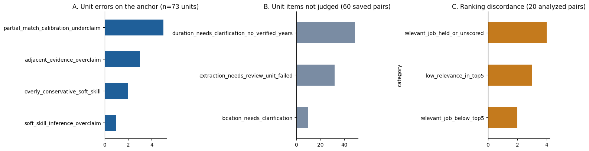
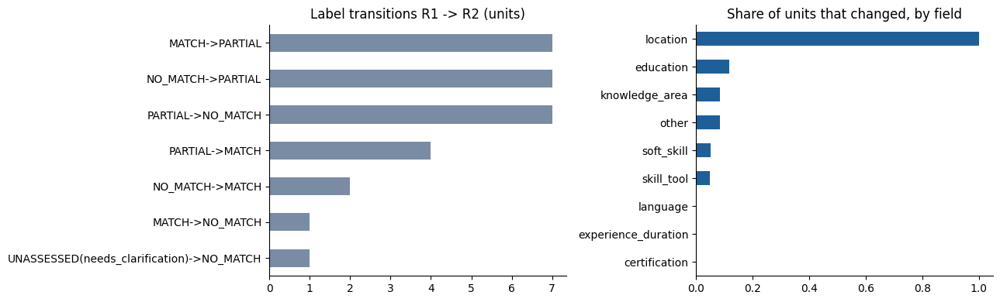
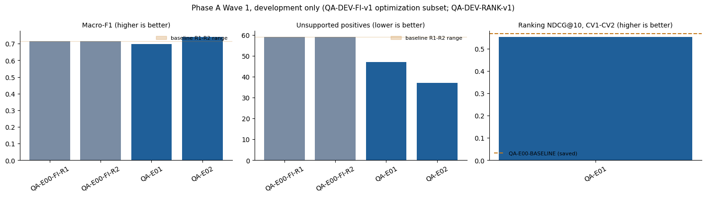
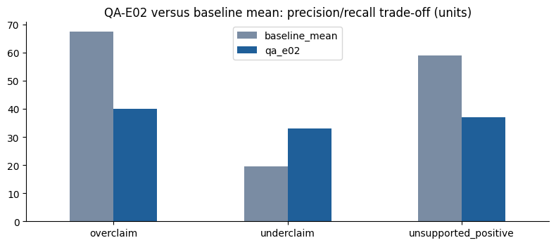

# CP2.8: Post-Test Quality Optimization (Phase A)

**Started and closed:** 7 October 2026. **Status:** CLOSED, KEEP BASELINE (D-090). Phase A spent US$2.38 on paid calls; adaptive stopping avoided about US$3.41. Decision record: [D-089](../decisions.md). Notebook: [`notebooks/03_post_test_quality_optimization.ipynb`](../../notebooks/03_post_test_quality_optimization.ipynb).

## 1. Objective

Find the evidence-matching prompt with the best quality on development data. Quality comes first. Cost and latency are recorded only; they become the objective in Phase B, which has not started.

## 2. Methodology

- One variable: the evidence-matching prompt. Model GPT-6 Sol (frozen request rules), retriever, K 10, PARTIAL weight 0.5, seniority and experience rules, H2v2, schema, quote-check v1.1 and G1/G2 are the D-087 settings. Phase A runs Sol without the Luna fallback so a fallback never hides a prompt effect.
- Each challenger keeps the v1.1 text word for word and adds one paragraph. New file per prompt, with a metadata file (experiment ID, parent, hypothesis, date, intended change, sha256). No file is called "final".
- Waves: Wave 1 has three challengers, each with its own hypothesis, plus two baseline runs to measure noise.
- Selection hierarchy (D-089, approved): grounding/correctness and schema/reliability are hard gates; unit matching quality (macro-F1, accuracy, error categories) is the primary objective; ranking is non-inferiority (P@5 not lower, NDCG@10 not lower by more than 0.02); holds are a secondary diagnostic; cost and latency are observability only. Better ranking never rescues worse grounding.
- Amendment 1 (locked before E01, `selection_rule_v2.json`): macro-F1 0.7343 is a practical reference, not a hard gate. Hard gates: quote validity 1.0; unsupported positives <= 59; prompt-induced failed pairs <= 0; ranking non-inferiority. Eligible by path A (macro-F1 >= 0.7343, accuracy not lower, holds with any pair left out) or path B (unsupported positives <= 53 and overclaims <= 60, macro-F1 and accuracy not below baseline, spread over >= 3 pairs), with no other regression. One provisional finalist, then its repeat `<ID>-R2` on the same subset; confirmation opens only if the repeat passes.
- Amendment 2 (locked before QA-E02): staged execution. Stage A = 20 fixed-input pairs, evaluated offline; `stage-a-check` stops the challenger or continues to Stage B (19 ranking pairs). Stop on quote validity < 1.0, unsupported positives over the limit, prompt/schema failure, other regression, or when neither path can be met (both are unit-level). QA-E03 runs only if E01/E02 are ambiguous. If E02 stops and nothing is eligible, Phase A stops and the baseline stays.
- Failure handling: prompt/schema-induced failures count against the prompt and are never retried. Transient provider, network or budget failures get one documented retry with the same prompt (`recover`), else the run is invalid. Retries are never used to get better outputs.
- Scope: Phase A measures primary GPT-6 Sol prompt behavior. It does not measure production fallback reliability (Sol then Luna); a separate integration run checks that after a prompt is chosen.
- Staged Wave 1: R1, R2, E01, E02, E03 in order (the runner refuses a run before the previous one is evaluated), then `select`, then only the finalist's repeat. QA-E03-R is withdrawn.
- Confirmation subset: sealed until exactly one finalist is recorded and its repeat passes; no per-item confirmation output before that.
- Tooling: `scripts/qa_phase_a.py` (`baseline`, `dry-run`, `run`, `evaluate`, `status`) and `src/jobfit/eval/qa_phase_a.py`. Every run writes `config.json`, `metrics.json`, `failures.json`, `cost.json`, `receipt.json` in its own folder under `evals/results/quality_optimization/`, and one row in `experiment_registry.csv`.

## 3. Anti-test-leakage rule

CP2.4 is a historical frozen evaluation. Phase A never reads `evals/gold/test_v13_cp24_r1`, the test workbook, `evals/results/cp24/`, the CP2.4 pool or the CV3-CV5 files, and never uses a test job. `dev_path` and `check_pairs` raise `LeakageError`; `tests/test_qa_phase_a.py` checks every one of these paths and CVs. CP2.4 is not rerun for challengers.

## 4. Baseline (QA-E00-BASELINE)

Reproduced offline from saved development artifacts, no call:

| Item | Value |
| --- | --- |
| Configuration | `pipeline-cp23-freeze-candidate-v4`, GPT-6 Sol, prompt v1.1 (`evidence_matching_v1_1.md`), quote-check v1.1, G1/G2, Hybrid Qwen, K 10, weight 0.5, seniority rule, experience block, H2v2 |
| Ranking, CV1-CV2 analyzed top 10 (20 pairs) | P@5 0.70, NDCG@10 0.567 (same as D-086 with the block); 4/20 held or unscored |
| Grounding, 60 saved pairs | 676/676 MATCH/PARTIAL items with exact quotes; 0 schema failures, 0 repairs |
| r3 anchor (73 units, 4 pairs) | macro-F1 0.846; 11 unit errors; run-to-run agreement 64/73 |
| Cost and latency (saved run) | US$1.48 for 53 calls, about US$0.028 per pair; median 15.3 s |

Full record (prompt sha256, dataset sha256, versions): `evals/results/quality_optimization/QA-E00-BASELINE/`.

## 5. Failure taxonomy

| Source | Category | Count |
| --- | --- | --- |
| A. r3 anchor (73 units) | MATCH/PARTIAL underclaim (clear use labeled PARTIAL) | 5 |
| | Adjacent or umbrella evidence overclaim | 3 |
| | Soft skill too strict (NO_MATCH where gold is PARTIAL) | 2 |
| | Soft skill inferred (PARTIAL where gold is NO_MATCH) | 1 |
| | Run-to-run label changes on identical input | 9 of 73 |
| B. 60 saved pipeline pairs | Pair held: extraction not usable | 6 |
| | Unit not judged: duration without verified years | 49 |
| | Unit not judged: extraction `needs_review` | 32 |
| | Unit not judged: location | 10 |
| | Invalid quotes, schema failures, repairs | 0 |
| | Responsibility extracted as qualification | 2 units, 1 JD |
| C. Ranking, 20 analyzed pairs | Low relevance (0-1) in top 5 | 3 |
| | Relevant job held or unscored | 4 |
| | Relevant job below top 5 | 2 |

Not observed in the anchor errors: AND/OR mistakes and education mismatches. Not measurable: wrong CV section (the output has no section field).

Reading: the matching prompt can only reach group A. Groups B and C are mostly caused by inputs and rules that stay fixed (extraction, unverified durations, H2v2, role fit). So a prompt win should show up mainly in unit quality, and a large ranking gain from a prompt alone would be suspicious. Extraction-side hypotheses (needs_review units, over-splitting long lists) are candidates for a later wave and need an extraction benchmark first.

Figure A1 (development only; three separate denominators: 73 anchor units, 60 saved pairs, 20 analyzed pairs; never pooled):

## 6. Hypotheses

| ID | Hypothesis | Evidence | Prompt |
| --- | --- | --- | --- |
| QA-H01 | v1.1 lowers clear contextual use to PARTIAL more often than guideline B1/B2 allows | 5 underclaims in A | `evidence_matching_v1_2_qa_e01.md` |
| QA-H02 | v1.1 accepts neighbouring or umbrella evidence as direct evidence and infers soft skills | 3 + 1 overclaims in A | `evidence_matching_v1_2_qa_e02.md` |
| QA-H03 | Dense unordered instructions cause label changes between identical runs | 9/73 run-to-run changes | `evidence_matching_v1_2_qa_e03.md` |

## 7. Experiment table (Wave 1, as proposed before any run; historical plan)

The final runs and costs are in sections 8 and 11. QA-E03, QA-E03-R and the finalist repeat in this table never ran, and QA-E02 ran Stage A only (20 calls).

| ID | Prompt | Data | Calls | Estimate (upper), US$ |
| --- | --- | --- | --- | --- |
| QA-E00-FI-R1 | v1.1 | FI optimization (20 pairs) | 20 | 0.57 (0.80) |
| QA-E00-FI-R2 | v1.1, repeat | FI optimization | 20 | 0.57 (0.80) |
| QA-E01 | v1.2-qa-e01 | FI optimization + RANK (19) | 39 | 1.15 (1.61) |
| QA-E02 | v1.2-qa-e02 | FI optimization + RANK | 39 | 1.14 (1.60) |
| QA-E03 | v1.2-qa-e03 | FI optimization + RANK | 39 | 1.14 (1.60) |
| QA-E0x-R2 (finalist repeat only) | finalist prompt, repeat | FI optimization | 20 | about 0.56 (0.78) |
| QA-E03-R | withdrawn by amendment 1 (never run) | | | |
| **Total Wave 1 incl. finalist repeat** | | | **177** | **about 5.2 (7.2)**, cap 7.50 |

Estimates use the median (p90) of 91 observed Sol matching calls in the usage ledger, scaled for the longer prompt.

## 8. Results

### 8.1 Baseline repeatability (QA-E00-FI-R1 vs QA-E00-FI-R2)

Same prompt (v1.1), same 20 optimization pairs, two runs. Computed offline (`python scripts/qa_phase_a.py repeatability --a QA-E00-FI-R1 --b QA-E00-FI-R2`; result in `evals/results/quality_optimization/analysis/repeatability_QA-E00-FI-R1_vs_QA-E00-FI-R2_v1.json`).

| Metric | R1 | R2 |
| --- | --- | --- |
| Macro-F1 | 0.7139 | 0.7146 |
| Accuracy (all 411 units) | 0.7518 | 0.7543 |
| Overclaim / underclaim | 67 / 20 | 68 / 19 |
| Unsupported positives (gold NO_MATCH, model MATCH/PARTIAL) | 59 | 59 |
| Unassessed units | 15 | 14 |
| Failed pairs, repairs | 0, 0 | 0, 0 |
| Quote validity | 255/255 | 255/255 |
| Cost, median / p95 latency | US$0.504, 18.2 / 24.7 s | US$0.373, 20.0 / 29.0 s |

- Exact unit agreement: 382 of 411 units (92.9%); 29 units changed.
- Transitions R1 -> R2: PARTIAL->NO_MATCH 7, NO_MATCH->PARTIAL 7, MATCH->PARTIAL 7, PARTIAL->MATCH 4, NO_MATCH->MATCH 2, MATCH->NO_MATCH 1, needs_clarification->NO_MATCH 1. So 25 of 29 changes are one step on the label scale (next to each other), 3 jump between MATCH and NO_MATCH.
- Where: knowledge_area 17 of 203 units (8.4%), skill_tool 4/81, soft_skill 4/76, education 2/17, other 1/12, location 1/1; experience_duration 0/14, language 0/6. CV2 has 21 changes, CV1 8. Three CV2 pairs hold 13 of the 29 (F00059 5, F00442 4, F00558 4). Required units 23, preferred 6.
- The changes do not lean one way: R1 matches gold on 11 changed units, R2 on 12, neither on 6. The metric gap is tiny (macro-F1 0.0008) because the changes cancel out.
- Finalist bars that follow from D-089: macro-F1 above 0.7143 + 0.02 = 0.7343; unsupported positives at most 59; failed pairs at most 1; quote validity 1.0.

Observation for the record (taxonomy and order unchanged, as approved): on this optimization subset the baseline errs mostly by overclaiming (67-68 over vs 19-20 under; 59 unsupported positives, mainly knowledge_area 34-35 and soft_skill 15). The anchor taxonomy that motivated QA-H01 showed more underclaims (5 vs 4). QA-E01 pushes toward MATCH, so it carries a real risk of failing the unsupported-positive gate; QA-E02 points in the direction of the dominant error.

Figure A2 (development only; 411 optimization units per run; location has a single unit, so its full bar is one unit):

### 8.2 Challengers

#### QA-E01 (QA-H01, MATCH/PARTIAL calibration): not eligible

Run by Dion on 7 October 2026 (38 calls, US$0.99, 0 repairs, median 19.0 s / p95 27.5 s). Scorecard: `evals/results/quality_optimization/analysis/scorecard_QA-E01_v1.json` against the locked `selection_rule_v2.json`.

| Metric | Baseline R1 / R2 | QA-E01 | Rule |
| --- | --- | --- | --- |
| Macro-F1 | 0.7139 / 0.7146 | 0.6992 | path A needs >= 0.7343; path B needs >= 0.7143 |
| Accuracy (411 units) | 0.7518 / 0.7543 | 0.7591 | >= 0.7530 |
| Unsupported positives | 59 / 59 | 47 | gate <= 59; path B <= 53 |
| Overclaims / underclaims | 67 / 20, 68 / 19 | 61 / 23 | path B overclaims <= 60; underclaims <= 25 |
| Unassessed, failed pairs | 15 / 14, 0 | 15, 0 | <= 17, <= 0 |
| Quote validity | 1.0 | 1.0 (463/463 positive items) | 1.0 |
| Ranking P@5 / NDCG@10 (CV1-CV2) | 0.70 / 0.567 (saved) | 0.70 / 0.553 | >= 0.70 / >= 0.547 |
| Held or unscored in top 10 | 4/20 | 4/20 (same jobs) | diagnostic |

- Hard gates: all pass (quotes, unsupported positives, prompt failures, transient failures, ranking).
- Path A: fails, macro-F1 0.6992 is below the reference 0.7343.
- Path B: fails on two conditions: overclaims 61 (limit 60) and macro-F1 0.6992 below the baseline mean 0.7143. Unsupported positives 47 (limit 53), accuracy and the 11-pair spread pass.
- Result: passes the gates, not eligible.

What changed (confusion against R1): the prompt mostly stopped using PARTIAL. Gold NO_MATCH units labeled PARTIAL fell from 40 to 21, which removes 12 unsupported positives, but gold NO_MATCH units labeled MATCH rose from 19 to 26, and gold PARTIAL units labeled MATCH rose from 8 to 14. PARTIAL F1 fell (0.467 to 0.430) and MATCH F1 fell (0.872 to 0.835), so macro-F1 dropped while accuracy rose. Soft-skill overclaims fell (16 to 9); knowledge-area overclaims stayed at 41. Reading: fewer weak positives, but more full MATCH claims without evidence, which is the more harmful error for a user. QA-H01 is not supported on this subset.

Next (adaptive stopping, Dion): QA-E02 runs because it targets the main baseline error (overclaims). QA-E03 does not run automatically.

#### QA-E02 (QA-H02, direct-evidence check): precision/recall trade-off, stopped at Stage A

Run by Dion (Stage A only: 20 calls, US$0.50, 0 repairs, median 20.7 s / p95 25.3 s). Stage check: `analysis/stage_a_check_QA-E02_v1.json`.

| Metric | Baseline R1 / R2 | QA-E01 | QA-E02 (Stage A) | Rule |
| --- | --- | --- | --- | --- |
| Macro-F1 | 0.7139 / 0.7146 | 0.6992 | **0.7397** | A >= 0.7343; B >= 0.7143 |
| Accuracy | 0.7518 / 0.7543 | 0.7591 | **0.7859** | >= 0.7530 |
| Unsupported positives | 59 / 59 | 47 | **37** | gate <= 59; B <= 53 |
| Overclaims | 67 / 68 | 61 | **40** | B <= 60 |
| Underclaims | 20 / 19 | 23 | **33** | no regression <= 25 |
| Unassessed | 15 / 14 | 15 | 15 | <= 17 |
| Quote validity | 1.0 | 1.0 | 1.0 (222/222) | 1.0 |
| Per-class F1 MATCH / PARTIAL / NO_MATCH | 0.872 / 0.467 / 0.803 (R1) | 0.835 / 0.430 / 0.833 | 0.901 / 0.468 / 0.850 | |

- Gates pass; path A and path B are both met; the only failed condition is the locked no-regression limit on underclaims (33 > 25). So `stage-a-check` = stop, and no ranking call was made (amendment 2).
- Trade-off: the direct-evidence check removes most unsupported claims (gold NO_MATCH labeled MATCH 7 vs 19/16; labeled PARTIAL 30 vs 40/43) but also removes some true evidence (gold MATCH labeled PARTIAL 12 vs 9; gold PARTIAL labeled NO_MATCH 17 vs 10/9; gold MATCH labeled NO_MATCH 4 vs 1). The new underclaims sit mostly in knowledge_area (20) and soft_skill (7).
- Reading: QA-E02 is the most useful finding of Phase A. It points at the main baseline error and fixes most of it, but it is too strict for knowledge areas and partial evidence. Under the rule it is not eligible; it is recorded as a future direction (QA-H04), not as a plain failure.

Figures A3 and A4 (development only; QA-DEV-FI-v1 optimization subset, 411 units per run; the A3 ranking panel exists only for QA-E01 because QA-E02 stopped at Stage A; the A3 macro-F1 axis starts at 0, so use the table values):

#### Final selection

`python scripts/qa_phase_a.py select` -> no provisional finalist (`analysis/wave1_selection_v1.json`). QA-E03 not run (adaptive stopping); no finalist repeat; confirmation subset sealed and unused.

### 8.3 Budget plan for the rest of Phase A (historical, computed before QA-E02; most of it was not spent, section 11) (`python scripts/qa_phase_a.py budget-plan`)

| Item | US$ |
| --- | --- |
| Current spend (JobFit ledger) | 9.03 |
| QA-E01 / E02 / E03 upper bounds | 1.52 / 1.52 / 1.51 |
| Finalist repeat (largest prompt) | 0.78 |
| Confirmation: baseline + finalist, 22 pairs each | 1.70 |
| Remaining upper total | 7.04 |
| Safety buffer (one retry for about 10% of calls, probes) | 0.75 |
| Needed in total | 16.82 |
| **Recommended OpenRouter key limit** | **17.00** |
| Margin to the project hard stop (18.50) | 1.50 |

The planned US$16.5 does not cover the upper bounds plus buffer (16.82), so the limit is set to US$17.00. If the key's own usage is higher than the ledger, the difference is added. No run starts unless `limit_remaining` covers its upper bound.

## 9. Selected challenger

None. No challenger met the locked rule ([D-089](../decisions.md)); the baseline prompt v1.1 stays ([D-090](../decisions.md)).

## 10. Limitations

- Two synthetic development CVs; ranking can only move inside the same 10 analyzed jobs per CV.
- Development references are not independent human ground truth. gap_v2 labels are model-draft-assisted and accepted by Dion (D-085); r3 anchor labels are model drafts reviewed with delegated follow-up QA (source metadata counts in `benchmark_v1/provenance.json`). If a draft model shares a family with the matcher, correlated model preferences can inflate agreement; this risk is not measured.
- Results measure primary-Sol prompt behavior, not production fallback reliability.
- Baseline noise comes from two runs only; most challengers run once.
- Durations are never verified in this setup, so duration units stay unclear for every prompt.
- Several prompts are tried on one optimization subset, so the best one looks better there than it is; the confirmation subset is used once to check this.

## 11. Final decision

**KEEP BASELINE** (D-090). The deployed configuration stays the D-087 freeze with evidence prompt v1.1.

| Cost item | US$ |
| --- | --- |
| QA-E00-FI-R1 / R2 | 0.504 / 0.373 |
| QA-E01 (fixed-input + ranking) | 0.994 |
| QA-E02 Stage A | 0.505 |
| Access probes | < 0.001 |
| **Phase A total** | **2.376** (101 calls) |
| Avoided by adaptive stopping (E02 Stage B, E03, finalist repeat, two confirmation runs) | about 3.41 (upper 4.62) |

Future hypothesis QA-H04 (Phase A2, not created, not run): keep QA-E02's direct-evidence behaviour for named tools, frameworks and components, while applied use of a knowledge area stays MATCH and related-but-partial evidence stays PARTIAL. Details and conditions: `evals/results/quality_optimization/analysis/phase_a_conclusion_v1.json`.

## 12. Next phase

Deployment and the final deck use the D-087 baseline. Phase A2 (QA-H04) is optional and only with its own decision; Phase B (efficiency) can start from the baseline because Phase A selected it.

**Claim boundary (closeout, 7 October 2026):** Phase A is post-test development work. It never read CP2.4 labels, results, CV3-CV5 or test jobs (`LeakageError`, tested), and it does not modify the CP2.4 held-out claim. CLOSED with KEEP BASELINE; QA-H04 / Phase A2 is not created and not run. Receipt hashes for the figures and notebook were rechecked in the [CP2 closeout audit](CP2_Closeout_Audit_20261007.md#7-notebook-verification).

